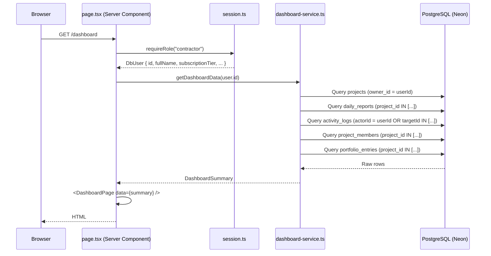

# Design Document — dashboard-real-data

## Overview

Fitur ini menggantikan semua data mock/hardcoded pada Dashboard Utama Kontraktor (`/dashboard`) dengan data riil dari database PostgreSQL (Neon) via Drizzle ORM. Pendekatan yang diambil adalah **server-side data aggregation**: satu fungsi `getDashboardData(userId)` mengeksekusi semua query yang diperlukan di sisi server, mengagregasi hasilnya menjadi satu tipe `DashboardSummary`, lalu meneruskannya sebagai props ke komponen `DashboardPage` yang sudah ada.

Tidak ada perubahan arsitektur besar. Tidak ada API route baru. Tidak ada client-side fetching. Komponen `DashboardPage` tetap menjadi presentational component — hanya menerima data, tidak mengambilnya sendiri.

### Keputusan Desain Utama

| Keputusan | Pilihan | Alasan |
|---|---|---|
| Lokasi service | `src/features/dashboard/dashboard-service.ts` | Konsisten dengan pola `src/features/auth/auth-service.ts` |
| Tipe `DashboardSummary` | `src/features/dashboard/types.ts` | Dipisah dari `src/lib/contracts/types.ts` karena spesifik untuk dashboard |
| DB migration | File baru `drizzle/0002_*.sql` | Menambah `target_date` dan `completed_at` ke tabel `projects` |
| Seed script | `scripts/seed-demo.ts` + `npm run seed:demo` | Idempoten, dijalankan via tsx |
| Waktu WIB | Konversi manual `UTC + 7 jam` | Tidak ada dependency timezone tambahan |
| Greeting logic | Pure function `getGreetingLabel(hour: number)` | Mudah diuji secara terisolasi |
| Relative time | Pure function `formatRelativeTime(date: Date, now: Date)` | Mudah diuji secara terisolasi |
| Reminder generation | Pure function `buildReminders(data)` | Mudah diuji secara terisolasi |
| Project limit check | Computed di `getDashboardData` dari `users.subscriptionTier` | Tidak perlu query tambahan |

---

## Architecture

### Alur Data (Requirements-First → Server Component)



### Struktur File Baru

```
src/
  features/
    dashboard/
      dashboard-service.ts      ← getDashboardData() + semua query
      types.ts                  ← DashboardSummary + tipe turunan
      helpers.ts                ← Pure functions: greeting, relativeTime, reminders, sorting
  app/
    (app)/
      dashboard/
        page.tsx                ← DIMODIFIKASI: panggil getDashboardData, pass props
      _components/
        DashboardPage.tsx       ← DIMODIFIKASI: terima DashboardSummary sebagai props

drizzle/
  0002_dashboard_columns.sql    ← Tambah target_date, completed_at ke projects

scripts/
  seed-demo.ts                  ← Seed script idempoten untuk akun demo
```

### File yang Tidak Diubah

- `src/app/(app)/_components/mock-data.ts` — tetap ada, masih dipakai `/projects` dan `/projects/[id]`
- `src/lib/db/schema.ts` — diupdate untuk menambah kolom baru
- `src/lib/contracts/enums.ts` — tidak berubah
- `src/lib/auth/session.ts` — tidak berubah

---

## Components and Interfaces

### `getDashboardData(userId: string): Promise<DashboardSummary>`

Fungsi utama yang dipanggil dari `page.tsx`. Mengeksekusi semua query secara paralel di mana memungkinkan, lalu mengagregasi hasilnya.

```typescript
// src/features/dashboard/dashboard-service.ts
export async function getDashboardData(userId: string): Promise<DashboardSummary>
```

**Urutan eksekusi internal:**
1. Query `projects` WHERE `owner_id = userId` → dapatkan semua proyek + `projectIds`
2. Paralel (Promise.all):
   - Query `daily_reports` WHERE `project_id IN projectIds`
   - Query `activity_logs` WHERE `actor_id = userId` OR (`target_type = 'project'` AND `target_id IN projectIds`)
   - Query `project_members` WHERE `project_id IN projectIds` AND `is_active = true`
   - Query `portfolio_entries` WHERE `project_id IN projectIds`
3. Agregasi semua data menjadi `DashboardSummary`

**Error handling:**
- Jika query utama (projects) gagal → exception dilempar, ditangkap Next.js error boundary
- Jika query `activity_logs` gagal → `activities: []`, `activityLoadError: true` (partial failure)
- Jika tabel foto/material belum ada → nilai default `0` (graceful degradation)

### `DashboardSummary` Type

```typescript
// src/features/dashboard/types.ts

export type ReminderType = "danger" | "warning" | "success" | "info";

export type DashboardReminder = {
  id: string;
  type: ReminderType;
  title: string;
  description: string;
  actionLabel: string;
  href: string;
};

export type DashboardActivity = {
  id: string;
  type: ReminderType;
  description: string;
  time: string;           // Formatted relative time string (WIB)
  createdAt: Date;
};

export type ActiveProjectItem = {
  id: string;
  name: string;
  type: string;
  location: string;
  ownerName: string;
  status: "active" | "delayed";
  progress: number;       // 0–100
  targetDate: string | null;  // ISO date string "YYYY-MM-DD"
  daysRemaining: number | null;
  reportCount: number;
  photoCount: number;     // 0 sampai tabel photos tersedia
};

export type NearDeadlineProject = {
  id: string;
  name: string;
  targetDate: string;
  daysRemaining: number;
};

export type DashboardSummary = {
  // Blok A — Greeting
  fullName: string;
  greetingLabel: string;          // "Selamat pagi" | "Selamat siang" | "Selamat sore" | "Selamat malam"
  activeProjectCount: number;
  pendingReportCount: number;

  // Blok B — KPI Cards
  reportCompletionToday: string;  // "X/Y"
  averageProgress: number;        // integer 0–100
  finishedThisMonth: number;
  nearDeadlineProjects: NearDeadlineProject[];

  // Blok C — Reminders
  reminders: DashboardReminder[];

  // Blok D — Active Projects
  activeProjects: ActiveProjectItem[];

  // Blok E — Activities
  activities: DashboardActivity[];
  activityLoadError: boolean;

  // Baris Bawah — Secondary Stats
  nearestDeadlineDays: number;
  photosToday: number;
  materialsRecordedTotal: number;
  activeMemberCount: number;

  // State flags
  isProjectLimitReached: boolean;
};
```

### Pure Helper Functions

```typescript
// src/features/dashboard/helpers.ts

// Konversi UTC ke WIB (UTC+7)
export function toWIB(date: Date): Date

// Greeting berdasarkan jam WIB (0–23)
export function getGreetingLabel(hourWIB: number): string

// Format waktu relatif WIB
export function formatRelativeTime(date: Date, now: Date): string

// Hitung daysRemaining dari targetDate (WIB)
export function calcDaysRemaining(targetDate: Date, now: Date): number

// Build reminder list dari data agregat
export function buildReminders(params: BuildReminderParams): DashboardReminder[]

// Sort active projects by urgency
export function sortActiveProjects(projects: RawProject[]): RawProject[]

// Map activity action ke label Bahasa Indonesia
export function mapActionLabel(action: string): string

// Hitung project limit berdasarkan tier
export function isAtProjectLimit(
  activeCount: number,
  tier: SubscriptionTier
): boolean
```

### `DashboardPage` Component (dimodifikasi)

```typescript
// src/app/(app)/_components/DashboardPage.tsx
// SEBELUM: export function DashboardPage()
// SESUDAH: export function DashboardPage({ data }: { data: DashboardSummary })
```

Komponen tidak lagi mengimpor dari `mock-data.ts`. Semua data datang dari props.

### `page.tsx` (dimodifikasi)

```typescript
// src/app/(app)/dashboard/page.tsx
export default async function Page() {
  const user = await requireRole("contractor");
  const data = await getDashboardData(user.id);
  return <DashboardPage data={data} />;
}
```

---

## Data Models

### DB Migration: `drizzle/0002_dashboard_columns.sql`

```sql
ALTER TABLE "projects"
  ADD COLUMN "target_date" date,
  ADD COLUMN "completed_at" timestamp;
```

Kedua kolom nullable. `target_date` diisi saat proyek dibuat/diedit. `completed_at` diisi saat status proyek bertransisi ke `completed`.

### Schema Update: `src/lib/db/schema.ts`

```typescript
// Tambahan pada tabel projects:
targetDate: date("target_date"),
completedAt: timestamp("completed_at"),
```

### Drizzle Query Patterns

**Query 1 — Semua proyek milik user:**
```typescript
const allProjects = await db
  .select()
  .from(projects)
  .where(eq(projects.ownerId, userId));
```

**Query 2 — Daily reports untuk proyek user (paralel):**
```typescript
const reports = await db
  .select()
  .from(dailyReports)
  .where(inArray(dailyReports.projectId, projectIds));
```

**Query 3 — Activity logs relevan (paralel):**
```typescript
const activities = await db
  .select()
  .from(activityLogs)
  .where(
    or(
      eq(activityLogs.actorId, userId),
      and(
        eq(activityLogs.targetType, "project"),
        inArray(activityLogs.targetId, projectIds)
      )
    )
  )
  .orderBy(desc(activityLogs.createdAt))
  .limit(10);
```

**Query 4 — Project members aktif (paralel):**
```typescript
const members = await db
  .select()
  .from(projectMembers)
  .where(
    and(
      inArray(projectMembers.projectId, projectIds),
      eq(projectMembers.isActive, true)
    )
  );
```

**Query 5 — Portfolio entries (paralel):**
```typescript
const portfolios = await db
  .select()
  .from(portfolioEntries)
  .where(inArray(portfolioEntries.projectId, projectIds));
```

### Seed Script Data Model

Script `scripts/seed-demo.ts` menggunakan `db` instance yang sama. Idempotency dicapai dengan:
1. Cari user `arenoe.studio@gmail.com` — jika tidak ada, skip (tidak membuat user baru)
2. Cek apakah proyek demo sudah ada via `name` + `owner_id` — jika sudah ada, skip insert
3. Semua insert menggunakan `onConflictDoNothing()` atau cek eksplisit

**Data yang di-seed:**
- 3 proyek: 1 `active` (progress 65%), 1 `delayed` (progress 30%), 1 `completed` (progress 100%)
- Proyek active: `targetDate` = 5 hari dari tanggal seed (memicu near-deadline warning)
- Proyek delayed: `targetDate` = -2 hari dari tanggal seed (sudah lewat, memicu warning)
- Proyek completed: `completedAt` = bulan ini, tanpa portfolio entry (memicu success reminder)
- Proyek active: tidak ada laporan submitted hari ini (memicu danger reminder)
- 8+ entri `activity_logs` dengan action yang beragam
- 5+ `project_members` aktif lintas proyek
- 5+ `daily_reports` per proyek aktif

---

## Correctness Properties

*A property is a characteristic or behavior that should hold true across all valid executions of a system — essentially, a formal statement about what the system should do. Properties serve as the bridge between human-readable specifications and machine-verifiable correctness guarantees.*

### Property 1: Greeting label selalu sesuai range jam WIB

*For any* jam dalam rentang 5–11 (WIB), `getGreetingLabel` harus mengembalikan `"Selamat pagi"`. *For any* jam dalam rentang 12–14, harus mengembalikan `"Selamat siang"`. *For any* jam dalam rentang 15–17, harus mengembalikan `"Selamat sore"`. *For any* jam dalam rentang 18–23 atau 0–4, harus mengembalikan `"Selamat malam"`. Tidak ada jam valid (0–23) yang menghasilkan string selain keempat label tersebut.

**Validates: Requirements 2.2, 2.3, 2.4, 2.5**

---

### Property 2: activeProjectCount akurat untuk semua kombinasi status proyek

*For any* set proyek dengan status acak (draft/active/delayed/completed/archived), `activeProjectCount` dalam `DashboardSummary` harus selalu sama dengan jumlah proyek yang memiliki status `active` atau `delayed` — tidak lebih, tidak kurang.

**Validates: Requirements 2.6, 3.1**

---

### Property 3: reportCompletionToday selalu dalam format "X/Y" dengan nilai akurat

*For any* kombinasi proyek aktif dan laporan harian, `reportCompletionToday` harus selalu berformat `"X/Y"` di mana X adalah jumlah proyek aktif yang memiliki minimal satu laporan `submitted` hari ini (UTC+7), dan Y adalah total proyek aktif. X tidak pernah melebihi Y. Ketika Y = 0, hasilnya adalah `"0/0"`.

**Validates: Requirements 3.2**

---

### Property 4: averageProgress adalah rata-rata integer yang akurat

*For any* set proyek `active` atau `delayed` dengan nilai `progress` acak (0–100), `averageProgress` harus sama dengan `Math.round(sum(progress) / count)`. Ketika tidak ada proyek aktif, hasilnya adalah `0`. Nilai selalu berada dalam rentang 0–100.

**Validates: Requirements 3.3**

---

### Property 5: finishedThisMonth hanya menghitung proyek completed bulan ini

*For any* set proyek dengan status `completed` dan nilai `completedAt` acak (bulan ini vs bulan lain vs null), `finishedThisMonth` harus sama persis dengan jumlah proyek yang memiliki `completedAt` dalam bulan kalender yang sama dengan hari ini (UTC+7). Proyek dengan `completedAt` null atau bulan berbeda tidak dihitung.

**Validates: Requirements 3.4**

---

### Property 6: nearDeadlineProjects hanya berisi proyek dengan daysRemaining ≤ 7

*For any* set proyek `active` atau `delayed` dengan `targetDate` acak, `nearDeadlineProjects` harus berisi tepat proyek-proyek yang memiliki `daysRemaining` ≤ 7 (termasuk nilai negatif). Proyek dengan `targetDate` null tidak masuk. Proyek dengan `daysRemaining` > 7 tidak masuk.

**Validates: Requirements 3.5**

---

### Property 7: Reminder diurutkan dengan prioritas danger → warning → success → info

*For any* set kondisi data yang menghasilkan reminder dengan tipe acak, urutan output `reminders` harus selalu: semua `danger` dulu, kemudian `warning`, kemudian `success`, kemudian `info`. Tidak ada `warning` yang muncul sebelum `danger`, tidak ada `success` yang muncul sebelum `warning`.

**Validates: Requirements 4.4**

---

### Property 8: Jumlah reminder tidak pernah melebihi 5

*For any* kondisi data — termasuk kondisi yang memicu banyak reminder sekaligus (banyak proyek tanpa laporan, banyak proyek near-deadline, banyak proyek completed tanpa portfolio) — panjang array `reminders` dalam `DashboardSummary` tidak pernah melebihi 5.

**Validates: Requirements 4.5**

---

### Property 9: activeProjects hanya berisi proyek active/delayed, diurutkan berdasarkan urgensi, maksimal 5

*For any* set proyek dengan status dan `targetDate` acak, array `activeProjects` harus: (a) hanya berisi proyek berstatus `active` atau `delayed`, (b) proyek `delayed` selalu muncul sebelum proyek `active`, (c) di antara proyek `active`, diurutkan ascending berdasarkan `targetDate` (null di akhir), (d) panjang array tidak pernah melebihi 5.

**Validates: Requirements 5.1, 5.2, 5.3**

---

### Property 10: daysRemaining null jika dan hanya jika targetDate null

*For any* proyek dalam `activeProjects`, `daysRemaining` bernilai `null` jika dan hanya jika `targetDate` bernilai `null`. Tidak ada proyek dengan `targetDate` non-null yang memiliki `daysRemaining` null, dan sebaliknya.

**Validates: Requirements 5.5**

---

### Property 11: Format waktu relatif selalu sesuai breakpoint

*For any* timestamp `createdAt` dan waktu "sekarang" acak, `formatRelativeTime(createdAt, now)` harus mengembalikan: `"baru saja"` jika selisih < 1 menit, `"X menit lalu"` jika 1–59 menit, `"X jam lalu"` jika 1–23 jam, `"kemarin"` jika tepat 1 hari, `"X hari lalu"` jika 2–6 hari, format `"DD MMM YYYY"` jika ≥ 7 hari. Tidak ada timestamp valid yang menghasilkan string kosong atau format yang tidak terdefinisi.

**Validates: Requirements 6.5**

---

### Property 12: mapActionLabel mengembalikan label Indonesia untuk action dikenal, action asli untuk yang tidak dikenal

*For any* string `action`, `mapActionLabel(action)` harus mengembalikan label Bahasa Indonesia yang sesuai untuk action yang dikenal (`project_created`, `report_submitted`, `photo_uploaded`, `member_added`, `status_changed`, `material_recorded`), dan mengembalikan `action` itu sendiri (tidak diubah) untuk action yang tidak dikenal.

**Validates: Requirements 6.3**

---

### Property 13: isAtProjectLimit akurat untuk semua kombinasi tier dan jumlah proyek

*For any* kombinasi `subscriptionTier` (`free`, `pro`, `business`) dan `activeCount` (integer ≥ 0), `isAtProjectLimit(activeCount, tier)` harus mengembalikan `true` jika dan hanya jika: `free` dan `activeCount >= 1`, atau `pro` dan `activeCount >= 3`. Untuk `business`, selalu mengembalikan `false`. Tidak ada kombinasi valid yang menghasilkan hasil yang salah.

**Validates: Requirements 10.2, 10.3, 10.4**

---

### Property 14: DashboardSummary selalu memiliki shape yang valid untuk semua userId

*For any* `userId` yang valid (user ada di database), `getDashboardData(userId)` harus mengembalikan objek yang memiliki semua field `DashboardSummary` dengan tipe yang benar — tidak ada field yang `undefined`, tidak ada field numerik yang `NaN`, tidak ada field string yang `null` kecuali yang memang nullable (`targetDate`, `daysRemaining`).

**Validates: Requirements 1.3, 9.1**

---

## Error Handling

### Strategi Error

| Skenario | Perilaku |
|---|---|
| Query `projects` gagal | Lempar exception → Next.js error boundary menampilkan halaman error |
| Query `activity_logs` gagal | Return `activities: []`, `activityLoadError: true` — partial failure, dashboard tetap tampil |
| Query `project_members` gagal | Return `activeMemberCount: 0` — graceful degradation |
| Tabel `project_photos` belum ada | Return `photosToday: 0`, `photoCount: 0` — graceful degradation |
| Tabel `material_entries` belum ada | Return `materialsRecordedTotal: 0` — graceful degradation |
| User tidak punya proyek | Return `DashboardSummary` valid dengan semua nilai 0 dan array kosong |
| `userId` tidak valid | Exception dari query DB → ditangkap error boundary |

### Error Boundary

`page.tsx` adalah Server Component. Jika `getDashboardData` melempar exception, Next.js secara otomatis menampilkan `error.tsx` terdekat. Tidak perlu try-catch di `page.tsx` — biarkan exception propagate.

### Partial Failure Pattern

Untuk `activity_logs`, digunakan try-catch internal di dalam `getDashboardData`:

```typescript
let activities: DashboardActivity[] = [];
let activityLoadError = false;
try {
  activities = await fetchActivities(userId, projectIds, now);
} catch {
  activityLoadError = true;
}
```

---

## Testing Strategy

### Pendekatan Dual Testing

Fitur ini menggunakan dua lapisan pengujian yang saling melengkapi:

1. **Unit tests** — untuk contoh spesifik, edge case, dan error conditions
2. **Property-based tests** — untuk memverifikasi properti universal di atas

### Library PBT

Proyek sudah memiliki `fast-check@^4.8.0` sebagai devDependency. Semua property test menggunakan `fast-check`.

### Konfigurasi Property Tests

- Minimum **100 iterasi** per property test (default fast-check sudah 100)
- Setiap property test diberi tag komentar: `// Feature: dashboard-real-data, Property N: <deskripsi>`
- Setiap property diimplementasikan sebagai **satu** property-based test

### Lokasi Test Files

```
src/features/dashboard/
  __tests__/
    helpers.property.test.ts    ← Property tests untuk pure functions
    helpers.unit.test.ts        ← Unit tests untuk edge cases
    dashboard-service.test.ts   ← Integration tests (dengan DB mock)
```

### Unit Tests (Edge Cases)

```typescript
// helpers.unit.test.ts
describe("getGreetingLabel edge cases", () => {
  it("jam 5 (batas bawah pagi) → Selamat pagi");
  it("jam 11 (batas atas pagi) → Selamat pagi");
  it("jam 0 (tengah malam) → Selamat malam");
  it("jam 4 (batas atas malam) → Selamat malam");
});

describe("formatRelativeTime edge cases", () => {
  it("selisih tepat 0 detik → baru saja");
  it("selisih tepat 59 menit → 59 menit lalu");
  it("selisih tepat 1 jam → 1 jam lalu");
  it("selisih tepat 7 hari → format DD MMM YYYY");
});

describe("getDashboardData empty state", () => {
  it("user tanpa proyek → semua nilai 0, semua array kosong");
  it("activity_logs query gagal → activityLoadError: true, activities: []");
});
```

### Property Tests

```typescript
// helpers.property.test.ts
import fc from "fast-check";

// Feature: dashboard-real-data, Property 1: greeting label sesuai range jam WIB
test("greeting label selalu sesuai range jam WIB", () => {
  fc.assert(fc.property(fc.integer({ min: 0, max: 23 }), (hour) => {
    const label = getGreetingLabel(hour);
    if (hour >= 5 && hour <= 11) return label === "Selamat pagi";
    if (hour >= 12 && hour <= 14) return label === "Selamat siang";
    if (hour >= 15 && hour <= 17) return label === "Selamat sore";
    return label === "Selamat malam";
  }));
});

// Feature: dashboard-real-data, Property 7: reminder diurutkan danger → warning → success → info
test("reminder selalu diurutkan berdasarkan prioritas", () => {
  fc.assert(fc.property(/* generator reminder acak */, (reminders) => {
    const sorted = sortReminders(reminders);
    const priorityOrder = { danger: 0, warning: 1, success: 2, info: 3 };
    for (let i = 0; i < sorted.length - 1; i++) {
      expect(priorityOrder[sorted[i].type]).toBeLessThanOrEqual(
        priorityOrder[sorted[i + 1].type]
      );
    }
  }));
});

// Feature: dashboard-real-data, Property 8: jumlah reminder tidak pernah > 5
test("jumlah reminder tidak pernah melebihi 5", () => {
  fc.assert(fc.property(/* generator kondisi data acak */, (data) => {
    const reminders = buildReminders(data);
    return reminders.length <= 5;
  }));
});

// ... dan seterusnya untuk setiap property
```

### Integration Tests

```typescript
// dashboard-service.test.ts
describe("getDashboardData integration", () => {
  it("mengembalikan DashboardSummary valid untuk user dengan proyek");
  it("mengembalikan DashboardSummary valid untuk user tanpa proyek");
  it("melempar exception jika DB query gagal");
});
```

### Catatan Testing

- Pure functions di `helpers.ts` diuji tanpa mock DB — ini adalah target utama PBT
- `getDashboardData` diuji dengan mock Drizzle instance untuk menghindari koneksi DB nyata di CI
- Seed script diuji dengan satu integration test: jalankan dua kali, verifikasi tidak ada data duplikat (idempotency)
