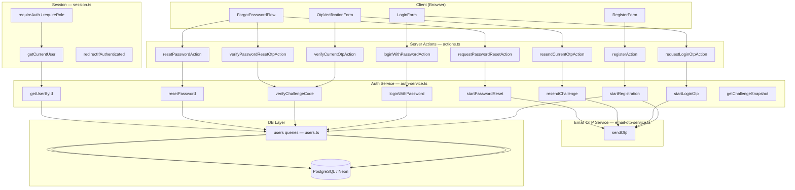

# Design Document — Real Authentication

## Overview

Fitur **Real Authentication** menggantikan sistem autentikasi mock (in-memory) dengan implementasi nyata berbasis PostgreSQL (Neon + Drizzle ORM), `bcryptjs` untuk password hashing, dan `resend` untuk pengiriman OTP via email.

Perubahan inti:
- Identifier login berubah dari `phone` → `email`
- `mock-auth-service.ts` digantikan oleh `auth-service.ts` yang query ke DB
- OTP challenge disimpan di tabel `otp_challenges` (bukan in-memory)
- OTP dikirim via email (Resend), bukan SMS
- `debugCode` dihapus dari semua response publik
- `secure: true` pada semua cookies

Semua route, cookie name, Server Actions, dan arsitektur session tetap tidak berubah.

---

## Architecture

### Diagram Komponen



### Alur Request per Flow

**Register:**
```
RegisterForm → registerAction → startRegistration()
  → bcryptjs.hash(password, 12)
  → INSERT otp_challenges (metadata = JSON pendaftaran)
  → Email_OTP_Service.sendOtp(email, code)
  → setOtpCookie(challengeId)
  → redirect /verify-otp
  → verifyCurrentOtpAction → verifyChallengeCode()
  → bcryptjs.compare(inputCode, codeHash)
  → BEGIN TRANSACTION
    → INSERT users (dari metadata)
    → DELETE otp_challenges
  → COMMIT
  → setSessionCookie(userId)
  → redirect /dashboard
```

**Login Password:**
```
LoginForm → loginWithPasswordAction → loginWithPassword()
  → SELECT users WHERE email = lower($email)
  → bcryptjs.compare(password, passwordHash)
  → setSessionCookie(userId)
  → redirect /dashboard atau /admin
```

**Login OTP:**
```
LoginForm → requestLoginOtpAction → startLoginOtp()
  → SELECT users WHERE email = lower($email)
  → INSERT otp_challenges
  → Email_OTP_Service.sendOtp(email, code)
  → setOtpCookie(challengeId)
  → redirect /verify-otp
  → verifyCurrentOtpAction → verifyChallengeCode()
  → setSessionCookie(userId)
```

**Lupa Password:**
```
ForgotPasswordFlow step 1 → requestPasswordResetAction → startPasswordReset()
  → SELECT users WHERE email = lower($email)
  → INSERT otp_challenges (flow = "forgot-password")
  → Email_OTP_Service.sendOtp(email, code)
  → setResetCookie(challengeId)
ForgotPasswordFlow step 2 → verifyPasswordResetOtpAction → verifyChallengeCode()
  → UPDATE otp_challenges SET is_verified = true
ForgotPasswordFlow step 3 → resetPasswordAction → resetPassword()
  → bcryptjs.hash(newPassword, 12)
  → UPDATE users SET password_hash = $hash
  → DELETE otp_challenges
  → clearResetCookie()
  → redirect /login?email=...
```

**Session Check (setiap protected layout):**
```
Layout → requireRole() / requireAuth()
  → getCurrentUser()
  → cookies().get("kp-auth-session")
  → getUserById(uuid) → SELECT users WHERE id = $uuid
  → redirect jika null atau role tidak sesuai
```

---

## Components and Interfaces

### Auth Service (`src/features/auth/auth-service.ts`)

```typescript
import "server-only";

// Input types
type PendingRegistration = {
  fullName: string;
  businessName: string;
  email: string;
  city: string;
  password: string;
};

// Return types (semua menggunakan ActionResult dari types.ts)

export async function startRegistration(
  input: PendingRegistration
): Promise<
  | { success: true; challenge: OtpChallengeSnapshot }
  | { success: false; fieldErrors?: Record<string, string>; message?: string }
>

export async function loginWithPassword(
  email: string,
  password: string
): Promise<
  | { success: true; user: DbUser; result: LoginSuccess }
  | { success: false; fieldErrors?: Record<string, string>; message?: string }
>

export async function startLoginOtp(
  email: string
): Promise<
  | { success: true; challenge: OtpChallengeSnapshot }
  | { success: false; fieldErrors?: Record<string, string>; message?: string }
>

export async function startPasswordReset(
  email: string
): Promise<
  | { success: true; challenge: OtpChallengeSnapshot; email: string }
  | { success: false; fieldErrors?: Record<string, string>; message?: string }
>

export async function verifyChallengeCode(
  challengeId: string,
  code: string
): Promise<
  | { success: true; challenge: OtpChallengeSnapshot; user: DbUser | null }
  | { success: false; message: string; challenge?: OtpChallengeSnapshot }
>

export async function resendChallenge(
  challengeId: string
): Promise<
  | { success: true; challenge: OtpChallengeSnapshot }
  | { success: false; message: string; challenge?: OtpChallengeSnapshot }
>

export async function resetPassword(
  challengeId: string,
  nextPassword: string
): Promise<
  | { success: true; email: string }
  | { success: false; fieldErrors?: Record<string, string>; message?: string }
>

export async function getUserById(
  userId: string
): Promise<DbUser | null>

export async function getChallengeSnapshot(
  challengeId: string
): Promise<OtpChallengeSnapshot | null>
```

### Email OTP Service (`src/lib/services/email-otp-service.ts`)

Mengimplementasikan interface `AuthOtpService` dari `src/lib/services/contracts.ts` dengan parameter `email` menggantikan `phone`.

```typescript
// Interface yang diperbarui di contracts.ts
export interface AuthOtpService {
  sendOtp(email: string, code: string): Promise<ActionResult<{ challengeId: string }>>;
}

// Implementasi
export const emailOtpService: AuthOtpService = {
  async sendOtp(email: string, code: string): Promise<ActionResult<{ challengeId: string }>>
}
```

Catatan: Interface `AuthOtpService` di `contracts.ts` perlu diperbarui — parameter `phone` diganti `email`, dan parameter `code` ditambahkan agar service bisa mengirim kode yang sudah di-generate oleh auth-service.

### DB Queries (`src/lib/db/queries/users.ts`)

```typescript
export async function findUserByEmail(email: string): Promise<DbUser | null>
export async function findUserById(id: string): Promise<DbUser | null>
export async function createUser(data: NewUser): Promise<DbUser>
export async function updateUserPassword(userId: string, passwordHash: string): Promise<void>
```

### DB Instance (`src/lib/db/index.ts`)

```typescript
import { neon } from "@neondatabase/serverless";
import { drizzle } from "drizzle-orm/neon-http";
import * as schema from "./schema";

const sql = neon(process.env.DATABASE_URL!);
export const db = drizzle(sql, { schema });
```

### Session Service (`src/lib/auth/session.ts`)

Signature fungsi tidak berubah. Hanya import yang berubah:
- `getUserById` diimport dari `auth-service.ts` (bukan `mock-auth-service.ts`)
- Return type berubah dari `MockUser | null` → `DbUser | null`

```typescript
export async function getCurrentUser(): Promise<DbUser | null>
export async function requireAuth(): Promise<DbUser>
export async function requireRole(roles: AuthRole | AuthRole[]): Promise<DbUser>
export async function redirectIfAuthenticated(): Promise<null>
```

---

## Data Models

### Perubahan Tabel `users`

Tabel `users` yang ada di `0000_tiny_guardian.sql` memiliki `phone` sebagai `NOT NULL UNIQUE`. Migrasi baru (`0001_real_auth.sql`) akan:

1. Menambah kolom `email` (varchar 255, unique, not null) — dengan default sementara untuk data existing
2. Mengubah kolom `phone` menjadi nullable

```sql
-- Migrasi 0001_real_auth.sql (dihasilkan oleh drizzle-kit generate)
ALTER TABLE "users" ADD COLUMN "email" varchar(255);
ALTER TABLE "users" ADD CONSTRAINT "users_email_unique" UNIQUE("email");
ALTER TABLE "users" ALTER COLUMN "phone" DROP NOT NULL;
ALTER TABLE "users" ALTER COLUMN "phone" DROP DEFAULT;
-- Hapus unique constraint phone (opsional, tergantung kebutuhan)
```

Drizzle schema yang diperbarui untuk tabel `users`:

```typescript
export const users = pgTable("users", {
  id: uuid("id").defaultRandom().primaryKey(),
  fullName: varchar("full_name", { length: 160 }).notNull(),
  businessName: varchar("business_name", { length: 160 }).notNull(),
  email: varchar("email", { length: 255 }).notNull().unique(),  // BARU
  phone: varchar("phone", { length: 24 }),                      // DIUBAH: nullable
  city: varchar("city", { length: 120 }).notNull(),
  role: roleEnum("role").default("contractor").notNull(),
  subscriptionTier: subscriptionTierEnum("subscription_tier").default("free").notNull(),
  passwordHash: text("password_hash").notNull(),
  suspended: boolean("suspended").default(false).notNull(),     // BARU
  firstLogin: boolean("first_login").default(true).notNull(),   // BARU
  createdAt: timestamp("created_at").defaultNow().notNull(),
  updatedAt: timestamp("updated_at").defaultNow().notNull(),
});
```

### Tabel Baru `otp_challenges`

```typescript
export const authIntentEnum = pgEnum("auth_intent", [
  "register",
  "login",
  "forgot-password",
]);

export const otpChallenges = pgTable("otp_challenges", {
  id: uuid("id").defaultRandom().primaryKey(),
  flow: authIntentEnum("flow").notNull(),
  email: varchar("email", { length: 255 }).notNull(),
  codeHash: text("code_hash").notNull(),
  expiresAt: timestamp("expires_at").notNull(),
  resendAvailableAt: timestamp("resend_available_at").notNull(),
  resendCount: integer("resend_count").default(0).notNull(),
  attemptsRemaining: integer("attempts_remaining").default(5).notNull(),
  lockedUntil: timestamp("locked_until"),
  isVerified: boolean("is_verified").default(false).notNull(),
  metadata: text("metadata"),  // JSON: PendingRegistration untuk flow "register"
  createdAt: timestamp("created_at").defaultNow().notNull(),
});
```

### Tipe `DbUser` (menggantikan `MockUser`)

```typescript
// src/features/auth/types.ts
export type DbUser = {
  id: string;
  fullName: string;
  businessName: string;
  email: string;
  phone?: string;
  city: string;
  role: AuthRole;
  suspended: boolean;
  firstLogin: boolean;
};
```

### Tipe `OtpChallengeSnapshot` (tanpa `debugCode`)

```typescript
export type OtpChallengeSnapshot = {
  id: string;
  flow: AuthIntent;
  maskedEmail: string;   // contoh: "b***@gmail.com"
  resendAvailableIn: number;
  resendsRemaining: number;
  attemptsRemaining: number;
  expiresIn: number;
  isLocked: boolean;
  lockRemainingIn: number;
  isVerified: boolean;
  // debugCode DIHAPUS
};
```

### Tipe `User` di `src/lib/contracts/types.ts`

```typescript
export type User = {
  id: string;
  fullName: string;
  businessName: string;
  email: string;       // BARU — identifier utama
  phone?: string;      // DIUBAH: opsional
  city: string;
  role: Role;
  subscriptionTier: SubscriptionTier;
};
```

---

## File Structure

### File Baru

```
src/
├── features/
│   └── auth/
│       └── auth-service.ts              # BARU — menggantikan mock-auth-service.ts
├── lib/
│   ├── db/
│   │   ├── index.ts                     # BARU — Drizzle db instance (Neon)
│   │   └── queries/
│   │       └── users.ts                 # BARU — query helpers untuk tabel users
│   └── services/
│       └── email-otp-service.ts         # BARU — implementasi Resend
drizzle/
└── 0001_real_auth.sql                   # BARU — migrasi email + otp_challenges
```

### File Dimodifikasi

```
src/
├── features/
│   └── auth/
│       ├── actions.ts                   # secure: true pada semua cookies
│       ├── schemas.ts                   # phone → email, tambah emailSchema
│       ├── types.ts                     # MockUser → DbUser, hapus debugCode
│       └── components/
│           ├── register-form.tsx        # field phone → email
│           ├── login-form.tsx           # field phone → email
│           ├── otp-verification-form.tsx # hapus debugCode display
│           └── forgot-password-flow.tsx  # field phone → email, hapus debugCode
├── lib/
│   ├── auth/
│   │   └── session.ts                   # import dari auth-service.ts
│   ├── contracts/
│   │   └── types.ts                     # User: tambah email, phone opsional
│   ├── db/
│   │   └── schema.ts                    # users: tambah email, phone nullable
│   │                                    # tambah otpChallenges table
│   └── services/
│       └── contracts.ts                 # AuthOtpService: phone → email
.env.example                             # tambah RESEND_API_KEY, RESEND_FROM_EMAIL
package.json                             # tambah bcryptjs, @types/bcryptjs, resend
```

### File Dihapus

```
src/features/auth/mock-auth-service.ts   # DIHAPUS setelah auth-service.ts selesai
```

---

## Auth Service Design

### Konstanta

```typescript
const OTP_EXPIRY_MS = 15 * 60 * 1000;        // 15 menit
const RESEND_COOLDOWN_MS = 60 * 1000;          // 60 detik
const RESEND_LIMIT = 3;
const ATTEMPT_LIMIT = 5;
const LOCK_DURATION_MS = 10 * 60 * 1000;       // 10 menit
const BCRYPT_COST_PASSWORD = 12;
const BCRYPT_COST_OTP = 10;
```

### Fungsi Internal

```typescript
function normalizeEmail(email: string): string {
  return email.trim().toLowerCase();
}

function maskEmail(email: string): string {
  // "budi@gmail.com" → "b***@gmail.com"
  const [local, domain] = email.split("@");
  return `${local[0]}***@${domain}`;
}

function generateOtpCode(): string {
  return String(Math.floor(100000 + Math.random() * 900000));
}

function mapChallengeToSnapshot(
  challenge: typeof otpChallenges.$inferSelect
): OtpChallengeSnapshot
```

### Detail Implementasi `startRegistration`

1. Normalize email ke lowercase
2. Query `SELECT id FROM users WHERE email = $email` — jika ada, return field error
3. Generate OTP code 6 digit
4. `bcryptjs.hash(code, BCRYPT_COST_OTP)` → `codeHash`
5. `bcryptjs.hash(password, BCRYPT_COST_PASSWORD)` → `passwordHash`
6. Serialize `{ fullName, businessName, email, city, passwordHash }` ke JSON → `metadata`
7. `INSERT INTO otp_challenges` dengan semua kolom
8. Panggil `emailOtpService.sendOtp(email, code)` — jika gagal, return error (challenge tidak disimpan atau dihapus)
9. Return `{ success: true, challenge: mapChallengeToSnapshot(record) }`

### Detail Implementasi `verifyChallengeCode`

1. `SELECT * FROM otp_challenges WHERE id = $challengeId`
2. Jika tidak ada → return error "Sesi OTP tidak ditemukan."
3. Jika `isVerified = true` atau `expiresAt < now` → return error "Sesi OTP tidak valid atau sudah kedaluwarsa."
4. Jika `lockedUntil > now` → return error dengan sisa waktu lock
5. `bcryptjs.compare(inputCode, codeHash)` — jika false:
   - `attemptsRemaining -= 1`
   - Jika `attemptsRemaining <= 0`: set `lockedUntil = now + LOCK_DURATION_MS`
   - `UPDATE otp_challenges SET attempts_remaining, locked_until`
   - Return error dengan sisa percobaan
6. Jika kode benar:
   - Jika `flow === "register"`:
     - Parse `metadata` → `{ fullName, businessName, email, city, passwordHash }`
     - BEGIN TRANSACTION
     - `INSERT INTO users`
     - `DELETE FROM otp_challenges WHERE id = $challengeId`
     - COMMIT
     - Return `{ success: true, challenge: snapshot, user: newUser }`
   - Jika `flow === "login"`:
     - `UPDATE otp_challenges SET is_verified = true`
     - `SELECT * FROM users WHERE email = $challenge.email`
     - Return `{ success: true, challenge: snapshot, user }`
   - Jika `flow === "forgot-password"`:
     - `UPDATE otp_challenges SET is_verified = true`
     - Return `{ success: true, challenge: snapshot, user: null }`

---

## Email OTP Service Design

### Implementasi Resend

```typescript
// src/lib/services/email-otp-service.ts
import "server-only";
import { Resend } from "resend";
import type { AuthOtpService } from "./contracts";

const resend = new Resend(process.env.RESEND_API_KEY);

const FROM_EMAIL =
  process.env.RESEND_FROM_EMAIL ?? "noreply@kontraktorpro.id";

export const emailOtpService: AuthOtpService = {
  async sendOtp(email: string, code: string) {
    try {
      const { error } = await resend.emails.send({
        from: FROM_EMAIL,
        to: email,
        subject: "Kode Verifikasi KontraktorPro",
        html: buildEmailHtml(code),
      });

      if (error) {
        return { success: false, message: "Gagal mengirim email OTP. Coba lagi." };
      }

      return { success: true, data: { challengeId: "" } };
    } catch {
      return { success: false, message: "Gagal mengirim email OTP. Coba lagi." };
    }
  },
};
```

### Template Email

Subject: `Kode Verifikasi KontraktorPro`

Body (HTML):
```
Kode verifikasi Anda: [CODE]

Kode ini berlaku selama 15 menit.
Jangan bagikan kode ini kepada siapapun.

Jika Anda tidak meminta kode ini, abaikan email ini.
```

### Catatan Desain

- `challengeId` di return value `sendOtp` tidak digunakan oleh implementasi ini karena `challengeId` sudah dibuat oleh `auth-service.ts` sebelum memanggil `sendOtp`. Field ini dipertahankan untuk kompatibilitas interface.
- Interface `AuthOtpService` di `contracts.ts` perlu diperbarui: parameter `phone` → `email`, tambah parameter `code: string`.
- Kode OTP plaintext hanya ada di memori saat `startRegistration`/`startLoginOtp`/`startPasswordReset` dipanggil — tidak pernah disimpan ke DB, tidak pernah dikembalikan ke client.

---

## Session Service Design

### `getCurrentUser` — Query ke DB

```typescript
// src/lib/auth/session.ts
import "server-only";
import { cookies } from "next/headers";
import { redirect } from "next/navigation";
import { getUserById } from "@/features/auth/auth-service";  // DIUBAH
import type { AuthRole, DbUser } from "@/features/auth/types"; // DIUBAH

const SESSION_COOKIE = "kp-auth-session";

export async function getCurrentUser(): Promise<DbUser | null> {
  const cookieStore = await cookies();
  const sessionUserId = cookieStore.get(SESSION_COOKIE)?.value;

  if (!sessionUserId) return null;

  // getUserById melakukan SELECT ke tabel users berdasarkan UUID
  return getUserById(sessionUserId);
}
```

### Alur `getUserById` di `auth-service.ts`

```typescript
export async function getUserById(userId: string): Promise<DbUser | null> {
  const result = await db
    .select()
    .from(users)
    .where(eq(users.id, userId))
    .limit(1);

  if (!result[0]) return null;

  return mapDbRowToDbUser(result[0]);
}
```

### Fungsi `mapDbRowToDbUser`

Mengkonversi row dari Drizzle ke tipe `DbUser` — memastikan `password_hash` tidak pernah terekspos ke layer di atas auth-service.

```typescript
function mapDbRowToDbUser(row: typeof users.$inferSelect): DbUser {
  return {
    id: row.id,
    fullName: row.fullName,
    businessName: row.businessName,
    email: row.email,
    phone: row.phone ?? undefined,
    city: row.city,
    role: row.role as AuthRole,
    suspended: row.suspended,
    firstLogin: row.firstLogin,
  };
}
```

`requireAuth()`, `requireRole()`, dan `redirectIfAuthenticated()` tidak berubah secara signature — hanya tipe return berubah dari `MockUser` ke `DbUser`.

---

## Migration Strategy

### Urutan Migrasi

**Migrasi yang ada — JANGAN DIUBAH:**
- `drizzle/0000_tiny_guardian.sql` — schema awal, termasuk tabel `users` dengan `phone NOT NULL UNIQUE`

**Migrasi baru yang akan dibuat:**
- `drizzle/0001_real_auth.sql` — dihasilkan oleh `drizzle-kit generate` setelah schema.ts diperbarui

### Perubahan Schema yang Memicu Migrasi `0001`

Di `src/lib/db/schema.ts`:

1. Tabel `users`:
   - Tambah kolom `email varchar(255) NOT NULL UNIQUE` — karena DB mungkin sudah punya data, perlu strategi default sementara
   - Ubah `phone` dari `NOT NULL` → nullable (hapus `.notNull()`)
   - Tambah kolom `suspended boolean DEFAULT false NOT NULL`
   - Tambah kolom `first_login boolean DEFAULT true NOT NULL`

2. Tabel baru `otp_challenges` — semua kolom seperti di Data Models

3. Enum baru `auth_intent` — `"register" | "login" | "forgot-password"`

### Strategi untuk Kolom `email NOT NULL` pada Data Existing

Karena DB mungkin sudah punya data (dari seed atau testing), migrasi perlu:

```sql
-- Step 1: Tambah kolom email sebagai nullable dulu
ALTER TABLE "users" ADD COLUMN "email" varchar(255);

-- Step 2: Isi email untuk data existing (gunakan placeholder berbasis id)
UPDATE "users" SET "email" = 'migrated_' || id || '@placeholder.local'
WHERE "email" IS NULL;

-- Step 3: Set NOT NULL dan UNIQUE
ALTER TABLE "users" ALTER COLUMN "email" SET NOT NULL;
ALTER TABLE "users" ADD CONSTRAINT "users_email_unique" UNIQUE("email");

-- Step 4: Ubah phone menjadi nullable
ALTER TABLE "users" ALTER COLUMN "phone" DROP NOT NULL;
```

Drizzle-kit generate akan menghasilkan SQL yang mendekati ini. Jika ada data existing dengan email placeholder, perlu diupdate manual setelah migrasi.

### Perintah

```bash
# 1. Update schema.ts
# 2. Generate migrasi
npm run db:generate

# 3. Review 0001_real_auth.sql sebelum apply
# 4. Apply migrasi
npx drizzle-kit migrate
```

---

## Security Design

### Password Hashing

- Library: `bcryptjs` (pure JS, tidak memerlukan native bindings — aman untuk Vercel/Neon serverless)
- Cost factor: **12** untuk password user
- Cost factor: **10** untuk OTP code (lebih rendah karena OTP berumur pendek dan perlu performa)
- Fungsi: `bcryptjs.hash(value, costFactor)` untuk hash, `bcryptjs.compare(plain, hash)` untuk verifikasi
- `password_hash` tidak pernah dikembalikan ke layer di atas `auth-service.ts`

### OTP Security

- Kode OTP 6 digit numerik, di-generate dengan `Math.random()` (cukup untuk OTP berumur pendek)
- Kode plaintext hanya ada di memori selama eksekusi `startRegistration`/`startLoginOtp`/`startPasswordReset`
- Kode langsung di-hash sebelum INSERT ke DB
- Kode dikirim ke email user — tidak pernah dikembalikan di response API
- `OtpChallengeSnapshot` tidak mengandung `debugCode` atau kode dalam bentuk apapun

### Cookie Security

Semua cookies menggunakan flag berikut:

```typescript
{
  httpOnly: true,    // tidak bisa diakses JavaScript client
  sameSite: "lax",   // proteksi CSRF
  secure: true,      // HTTPS only — WAJIB di production
  path: "/",
}
```

Cookie lifetimes:
- `kp-auth-session`: 30 hari (`maxAge: 30 * 24 * 60 * 60`)
- `kp-auth-otp`: 15 menit (`maxAge: 15 * 60`)
- `kp-auth-reset`: 15 menit (`maxAge: 15 * 60`, `path: "/forgot-password"`)

### Rate Limiting di Level Aplikasi

- `attempts_remaining`: 5 percobaan per challenge sebelum lockout
- `locked_until`: 10 menit lockout setelah attempts habis
- `resend_count`: maksimal 3 resend per challenge
- `resend_available_at`: cooldown 60 detik antar resend
- Challenge expired setelah 15 menit

### Email Masking

`maskedEmail` di `OtpChallengeSnapshot` menggunakan format `b***@gmail.com` — hanya karakter pertama local part yang terlihat.

### Lookup Case-Insensitive

Semua lookup email menggunakan `lower()` atau normalisasi di aplikasi:
```typescript
function normalizeEmail(email: string): string {
  return email.trim().toLowerCase();
}
```

Query Drizzle: `eq(users.email, normalizeEmail(inputEmail))`

---

## Error Handling

### Lapisan Error

```
DB Error (Neon/Drizzle)
  ↓ ditangkap di auth-service.ts (try/catch)
  ↓ dikembalikan sebagai { success: false, message: "Terjadi kesalahan sistem. Coba lagi." }
  ↓
Server Action (actions.ts)
  ↓ meneruskan message ke client
  ↓
UI Component
  ↓ menampilkan via InlineAlert atau setError(field, { message })
```

### Kategori Error dan Pesan

| Kondisi | Tipe Error | Pesan |
|---|---|---|
| Email sudah terdaftar (register) | `fieldErrors.email` | "Email sudah terdaftar. Silakan masuk." |
| Email tidak ditemukan (login) | `fieldErrors.email` | "Email tidak ditemukan. Daftar dulu?" |
| Password salah | `fieldErrors.password` | "Password salah." |
| Akun suspended | `message` | "Akun Anda dinonaktifkan. Hubungi tim KontraktorPro." |
| Kode OTP salah (N sisa) | `message` | "Kode salah. Sisa N percobaan." |
| OTP expired | `message` | "Kode sudah kedaluwarsa. Minta kode baru." |
| OTP locked | `message` | "Terlalu banyak percobaan. Coba lagi dalam N menit." |
| Resend sebelum cooldown | `message` | "Kirim ulang dalam N detik." |
| Resend limit tercapai | `message` | "Batas pengiriman ulang tercapai. Mulai proses dari awal." |
| Email tidak terdaftar (forgot password) | `fieldErrors.email` | "Email ini tidak terdaftar." |
| Sesi OTP tidak ditemukan | `message` | "Sesi OTP tidak ditemukan. Silakan ulangi dari login atau daftar." |
| Sesi OTP sudah diverifikasi | `message` | "Sesi OTP tidak valid atau sudah kedaluwarsa." |
| DB connection error | `message` | "Terjadi kesalahan sistem. Coba lagi." |
| Resend API error | `message` | "Gagal mengirim email OTP. Coba lagi." |

### Pola Error Handling di `auth-service.ts`

```typescript
export async function startRegistration(input: PendingRegistration) {
  try {
    // ... logika bisnis
  } catch (error) {
    console.error("[auth-service] startRegistration error:", error);
    return {
      success: false as const,
      message: "Terjadi kesalahan sistem. Coba lagi.",
    };
  }
}
```

Semua fungsi di `auth-service.ts` membungkus logika utama dalam `try/catch`. Error DB tidak pernah di-expose ke client — hanya pesan generik yang dikembalikan.

### Propagasi ke Server Actions

`actions.ts` tidak perlu menambahkan try/catch tambahan karena `auth-service.ts` sudah menangani semua error DB. Actions hanya perlu meneruskan `result.message` ke client.

### Propagasi ke UI

UI components menggunakan pola yang sudah ada:
- `fieldErrors` → `setError(field, { message })` via react-hook-form
- `message` → `setFormError(message)` → `<InlineAlert tone="danger">`

---

## Correctness Properties

*A property is a characteristic or behavior that should hold true across all valid executions of a system — essentially, a formal statement about what the system should do. Properties serve as the bridge between human-readable specifications and machine-verifiable correctness guarantees.*

Fitur ini melibatkan logika bisnis murni (validasi email, hashing, rate limiting, session lookup) yang bervariasi secara bermakna dengan input. Property-based testing cocok diterapkan di sini.

### Property 1: Validasi Email Schema

*For any* string input, schema validasi email (`z.string().email()`) harus menerima semua string yang merupakan email valid RFC 5322 dan menolak semua string yang bukan email valid — termasuk string kosong, whitespace, string tanpa `@`, dan string dengan format domain tidak valid.

**Validates: Requirements 1.7, 1.8, 1.9**

---

### Property 2: Lookup Email Case-Insensitive

*For any* email yang terdaftar di database, melakukan lookup dengan versi uppercase, lowercase, atau mixed-case dari email tersebut harus selalu mengembalikan user yang sama.

**Validates: Requirements 1.10**

---

### Property 3: bcryptjs Hash Round-Trip

*For any* string (password atau kode OTP), melakukan `bcryptjs.hash(value, cost)` kemudian `bcryptjs.compare(value, hash)` harus selalu mengembalikan `true`. Sebaliknya, `bcryptjs.compare(differentValue, hash)` harus selalu mengembalikan `false` jika `differentValue !== value`.

**Validates: Requirements 2.3, 2.7, 3.2, 3.3**

---

### Property 4: Register Flow Round-Trip

*For any* data registrasi valid (fullName, businessName, email unik, city, password), menjalankan full register flow (startRegistration → verifyChallengeCode) harus menghasilkan: (a) user baru ada di tabel `users` dengan data yang sesuai, (b) record `otp_challenges` yang digunakan sudah dihapus dari DB.

**Validates: Requirements 2.4, 2.5, 2.6**

---

### Property 5: Penolakan Email Duplikat

*For any* email yang sudah terdaftar di tabel `users`, memanggil `startRegistration` dengan email tersebut harus selalu mengembalikan `{ success: false, fieldErrors: { email: "Email sudah terdaftar. Silakan masuk." } }` — tidak peduli data lain yang diberikan.

**Validates: Requirements 2.2, 8.1**

---

### Property 6: Rate Limiting Invariant

*For any* OTP challenge, kombinasi dari tiga invariant berikut harus selalu berlaku:
- `resend_count` tidak pernah melebihi `RESEND_LIMIT` (3) — setelah batas tercapai, `resendChallenge` mengembalikan error
- `attempts_remaining` berkurang tepat 1 setiap kali kode salah dimasukkan
- Ketika `attempts_remaining` mencapai 0, `locked_until` diset ke `now + 10 menit` dan semua percobaan berikutnya ditolak

**Validates: Requirements 3.6, 3.7, 8.5**

---

### Property 7: OTP Tidak Pernah Terekspos Plaintext

*For any* OTP challenge yang dibuat, `getChallengeSnapshot` harus mengembalikan objek yang tidak mengandung field `debugCode`, tidak mengandung kode OTP plaintext, dan tidak mengandung `codeHash`. Satu-satunya representasi kode yang ada di DB adalah `code_hash`.

**Validates: Requirements 3.2, 5.1, 5.2, 5.3**

---

### Property 8: Session Round-Trip

*For any* user yang ada di tabel `users`, jika UUID user tersebut disimpan di cookie `kp-auth-session`, maka `getCurrentUser()` harus mengembalikan objek `DbUser` dengan data yang identik dengan yang ada di DB — termasuk `id`, `email`, `role`, dan `suspended`.

**Validates: Requirements 6.1, 6.3**

---

### Property 9: Login Credential Validation

*For any* email yang tidak ada di tabel `users`, `loginWithPassword` harus mengembalikan `fieldErrors.email`. *For any* password yang tidak cocok dengan `password_hash` user yang ada, `loginWithPassword` harus mengembalikan `fieldErrors.password`. Kedua kondisi ini harus berlaku untuk semua kombinasi input yang mungkin.

**Validates: Requirements 8.2, 8.3**

---

### Property 10: Forgot Password Email Validation

*For any* email yang tidak ada di tabel `users`, `startPasswordReset` harus selalu mengembalikan `{ success: false, fieldErrors: { email: "Email ini tidak terdaftar." } }`.

**Validates: Requirements 8.10**

---

### Property 11: Resend Menghasilkan Kode Baru

*For any* OTP challenge yang masih valid (belum expired, belum mencapai resend limit), memanggil `resendChallenge` setelah cooldown selesai harus menghasilkan `code_hash` yang berbeda dari `code_hash` sebelumnya di DB — membuktikan kode baru di-generate dan di-hash.

**Validates: Requirements 4.8**

---

## Testing Strategy

### Pendekatan Dual Testing

Fitur ini menggunakan dua lapisan testing yang saling melengkapi:

1. **Unit tests** — contoh spesifik, edge cases, error conditions
2. **Property-based tests** — properti universal yang berlaku untuk semua input

### Library

- **Test runner**: Vitest (sudah ada di `package.json`)
- **Property-based testing**: `fast-check` — library PBT untuk TypeScript/JavaScript
- **Mocking**: Vitest built-in mocks (`vi.mock`, `vi.fn`)

### Konfigurasi Property Tests

```typescript
// Setiap property test harus dijalankan minimal 100 iterasi
fc.assert(fc.property(...), { numRuns: 100 });
```

Tag format untuk setiap property test:
```typescript
// Feature: real-auth, Property N: <property_text>
```

### Unit Tests

Lokasi: `src/features/auth/__tests__/auth-service.test.ts`

Cakupan unit tests:
- `startRegistration` dengan email yang sudah ada → field error
- `loginWithPassword` dengan akun suspended → message error
- `verifyChallengeCode` dengan challenge expired → error
- `verifyChallengeCode` dengan challenge locked → error dengan sisa waktu
- `resendChallenge` sebelum cooldown → error dengan sisa waktu
- `resetPasswordAction` → redirectTo berisi `?email=` bukan `?phone=`
- `emailOtpService.sendOtp` ketika Resend API error → error message yang benar

### Property-Based Tests

Lokasi: `src/features/auth/__tests__/auth-service.property.test.ts`

Setiap property test mengimplementasikan satu Correctness Property dari section di atas:

```typescript
// Feature: real-auth, Property 3: bcryptjs hash round-trip
test("bcryptjs hash round-trip", async () => {
  await fc.assert(
    fc.asyncProperty(fc.string({ minLength: 1 }), async (value) => {
      const hash = await bcryptjs.hash(value, 10);
      expect(await bcryptjs.compare(value, hash)).toBe(true);
    }),
    { numRuns: 100 }
  );
});
```

### Integration Tests

Lokasi: `src/features/auth/__tests__/auth-flows.integration.test.ts`

Menggunakan test database (Neon branch atau local PostgreSQL):
- Full register flow end-to-end
- Full login password flow end-to-end
- Full forgot password flow end-to-end
- Session persistence setelah login

### Unit Tests untuk Email OTP Service

Lokasi: `src/lib/services/__tests__/email-otp-service.test.ts`

- Mock Resend client
- Verifikasi subject email benar
- Verifikasi body email berisi kode OTP
- Verifikasi error handling ketika Resend gagal

### Catatan Testing

- Property tests untuk DB (P4, P5, P8, P9, P10, P11) memerlukan test database — gunakan Vitest setup/teardown untuk isolasi
- Property tests murni (P1, P2, P3, P7) tidak memerlukan DB — bisa dijalankan sebagai pure unit tests
- Semua DB tests harus membersihkan data setelah setiap test (`afterEach` cleanup)
