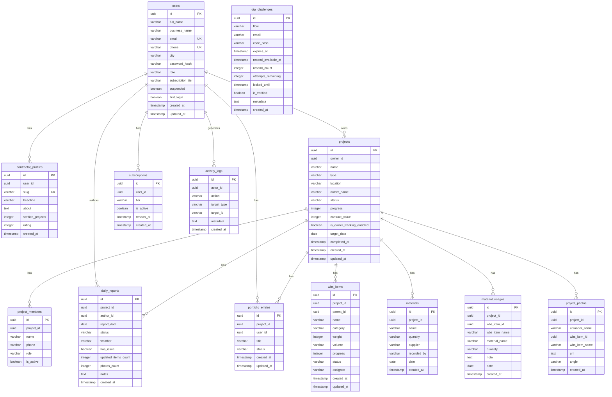

# Data Model — Source of Truth #4

Document Version: v1.1

Project: KontraktorPro

Product: Aplikasi Manajemen Proyek Konstruksi Berbasis Web (SaaS)

Status: Active

Last Updated: 2026-06-24

Author: System Analyst AI

Source: Derived from SRS v1.0 (SoT-1) + `src/lib/db/schema.ts` (actual Drizzle schema)

---

## 1. Overview

Dokumen ini mendefinisikan data model aktual KontraktorPro yang berjalan di database PostgreSQL (Neon serverless) melalui Drizzle ORM. Model ini diturunkan dari schema file `src/lib/db/schema.ts` dan SRS v1.0.

> **Penting:** Dokumen ini mencerminkan schema yang **sudah di-migrate ke Neon**. Setiap perubahan schema WAJIB menjalankan `npm run db:generate` dan mengapply migrasi ke Neon.

---

## 2. Entity Relationship Diagram

> **Catatan:** Tidak ada FK constraint yang dideklarasikan di Drizzle schema. Relasi bersifat logical, bukan enforced di DB level.

---

## 3. Entity Descriptions

### 3.1 users

Tabel inti yang menyimpan akun seluruh pengguna sistem (contractor, moderator, super_admin).

| Column | Type | Constraint | Description |
| --- | --- | --- | --- |
| `id` | UUID | PRIMARY KEY, DEFAULT gen_random_uuid() | Unique identifier |
| `full_name` | VARCHAR | NOT NULL | Nama lengkap |
| `business_name` | VARCHAR | NOT NULL | Nama bisnis |
| `email` | VARCHAR | UNIQUE, NOT NULL | Email login — dinormalisasi lowercase |
| `phone` | VARCHAR | UNIQUE, NULLABLE | Nomor telepon |
| `city` | VARCHAR | NOT NULL | Kota pengguna |
| `role` | ENUM (`role_enum`) | NOT NULL, DEFAULT 'contractor' | Role pengguna |
| `subscription_tier` | ENUM (`tier_enum`) | NOT NULL, DEFAULT 'free' | Tier langganan |
| `password_hash` | VARCHAR | NOT NULL | bcryptjs hash cost 12 |
| `suspended` | BOOLEAN | NOT NULL, DEFAULT false | Status suspend akun |
| `first_login` | BOOLEAN | NOT NULL, DEFAULT true | Flag untuk onboarding |
| `created_at` | TIMESTAMP | NOT NULL, DEFAULT now() | Waktu registrasi |
| `updated_at` | TIMESTAMP | NOT NULL, DEFAULT now() | Waktu update terakhir |

---

### 3.2 contractor_profiles

Profil publik kontraktor yang ditampilkan di direktori dan halaman profil.

| Column | Type | Constraint | Description |
| --- | --- | --- | --- |
| `id` | UUID | PRIMARY KEY | Unique identifier |
| `user_id` | UUID | NOT NULL | Referensi ke `users.id` (logical FK) |
| `slug` | VARCHAR | UNIQUE, NOT NULL | URL slug profil publik |
| `headline` | VARCHAR | NULLABLE | Slogan singkat |
| `about` | TEXT | NULLABLE | Tentang bisnis |
| `verified_projects` | INTEGER | DEFAULT 0 | Jumlah proyek terverifikasi |
| `rating` | INTEGER | NOT NULL, DEFAULT 0 | Rating rata-rata dari ulasan |
| `created_at` | TIMESTAMP | NOT NULL, DEFAULT now() | — |

---

### 3.3 projects

Data proyek konstruksi milik kontraktor.

| Column | Type | Constraint | Description |
| --- | --- | --- | --- |
| `id` | UUID | PRIMARY KEY | Unique identifier |
| `owner_id` | UUID | NOT NULL | Referensi ke `users.id` (logical FK) |
| `name` | VARCHAR | NOT NULL | Nama proyek |
| `type` | VARCHAR | NOT NULL | Jenis proyek (mis. residensial, komersial) |
| `location` | VARCHAR | NOT NULL | Lokasi proyek |
| `owner_name` | VARCHAR | NOT NULL | Nama pemilik proyek (klien) |
| `status` | ENUM (`project_status_enum`) | NOT NULL, DEFAULT 'draft' | Status proyek |
| `progress` | INTEGER | NOT NULL, DEFAULT 0 | Progress 0–100 |
| `contract_value` | INTEGER | NOT NULL, DEFAULT 0 | Nilai kontrak dalam IDR |
| `is_owner_tracking_enabled` | BOOLEAN | DEFAULT false | Aktifkan link pantau owner |
| `target_date` | DATE | NULLABLE | Target tanggal selesai |
| `completed_at` | TIMESTAMP | NULLABLE | Waktu selesai aktual |
| `created_at` | TIMESTAMP | NOT NULL, DEFAULT now() | — |
| `updated_at` | TIMESTAMP | NOT NULL, DEFAULT now() | — |

---

### 3.4 project_members

Anggota tim yang terlibat dalam proyek.

| Column | Type | Constraint | Description |
| --- | --- | --- | --- |
| `id` | UUID | PRIMARY KEY | Unique identifier |
| `project_id` | UUID | NOT NULL | Referensi ke `projects.id` (logical FK) |
| `name` | VARCHAR | NOT NULL | Nama anggota tim |
| `phone` | VARCHAR | NULLABLE | Nomor telepon |
| `role` | VARCHAR | NOT NULL | Role: `mandor`, `pekerja`, `spesialis` |
| `is_active` | BOOLEAN | NOT NULL, DEFAULT true | Status aktif anggota |

---

### 3.5 wbs_items

Work Breakdown Structure (WBS) dari sebuah proyek.

| Column | Type | Constraint | Description |
| --- | --- | --- | --- |
| `id` | UUID | PRIMARY KEY | Unique identifier |
| `project_id` | UUID | NOT NULL | Referensi ke `projects.id` |
| `parent_id` | UUID | NULLABLE | Hierarki (level 1 vs level 2) |
| `name` | VARCHAR | NOT NULL | Nama pekerjaan |
| `category` | VARCHAR | NOT NULL | Kategori pekerjaan |
| `weight` | INTEGER | NOT NULL | Bobot pekerjaan (%) |
| `volume` | VARCHAR | NULLABLE | Volume pekerjaan |
| `progress` | INTEGER | NOT NULL, DEFAULT 0 | Progress aktual (0-100) |
| `status` | ENUM (`wbs_status_enum`) | NOT NULL, DEFAULT 'Belum Dimulai' | Status WBS |
| `assignee` | VARCHAR | NULLABLE | Penanggung jawab |
| `created_at` | TIMESTAMP | NOT NULL, DEFAULT now() | — |
| `updated_at` | TIMESTAMP | NOT NULL, DEFAULT now() | — |

---

### 3.6 materials

Pencatatan masuknya material / stok material.

| Column | Type | Constraint | Description |
| --- | --- | --- | --- |
| `id` | UUID | PRIMARY KEY | Unique identifier |
| `project_id` | UUID | NOT NULL | Referensi ke `projects.id` |
| `name` | VARCHAR | NOT NULL | Nama material |
| `quantity` | VARCHAR | NOT NULL | Jumlah dan satuan |
| `supplier` | VARCHAR | NULLABLE | Pemasok material |
| `recorded_by` | VARCHAR | NULLABLE | Pencatat / penerima |
| `date` | DATE | NOT NULL | Tanggal pencatatan |
| `created_at` | TIMESTAMP | NOT NULL, DEFAULT now() | — |

---

### 3.7 material_usages

Pemakaian material terkait pekerjaan WBS tertentu.

| Column | Type | Constraint | Description |
| --- | --- | --- | --- |
| `id` | UUID | PRIMARY KEY | Unique identifier |
| `project_id` | UUID | NOT NULL | Referensi ke `projects.id` |
| `wbs_item_id` | UUID | NULLABLE | Referensi ke WBS item terkait |
| `wbs_item_name` | VARCHAR | NULLABLE | Denormalisasi nama WBS item |
| `material_name` | VARCHAR | NOT NULL | Nama material yang dipakai |
| `quantity` | VARCHAR | NOT NULL | Jumlah pemakaian |
| `note` | TEXT | NULLABLE | Catatan |
| `date` | DATE | NOT NULL | Tanggal pemakaian |
| `created_at` | TIMESTAMP | NOT NULL, DEFAULT now() | — |

---

### 3.8 project_photos

Dokumentasi foto lapangan proyek.

| Column | Type | Constraint | Description |
| --- | --- | --- | --- |
| `id` | UUID | PRIMARY KEY | Unique identifier |
| `project_id` | UUID | NOT NULL | Referensi ke `projects.id` |
| `uploader_name` | VARCHAR | NULLABLE | Nama pengunggah |
| `wbs_item_id` | UUID | NULLABLE | Referensi ke WBS item terkait |
| `wbs_item_name` | VARCHAR | NULLABLE | Denormalisasi nama WBS item |
| `url` | TEXT | NOT NULL | URL foto |
| `angle` | VARCHAR | NULLABLE | Angle pengambilan foto |
| `created_at` | TIMESTAMP | NOT NULL, DEFAULT now() | — |

---

### 3.9 daily_reports

Laporan harian per proyek yang dibuat oleh kontraktor.

| Column | Type | Constraint | Description |
| --- | --- | --- | --- |
| `id` | UUID | PRIMARY KEY | Unique identifier |
| `project_id` | UUID | NOT NULL | Referensi ke `projects.id` (logical FK) |
| `author_id` | UUID | NULLABLE | Referensi ke `users.id` (logical FK) |
| `status` | ENUM (`report_status_enum`) | NOT NULL, DEFAULT 'draft' | Status laporan |
| `weather` | VARCHAR | NULLABLE | Kondisi cuaca |
| `has_issue` | BOOLEAN | NOT NULL, DEFAULT false | Flag jika ada masalah |
| `updated_items_count` | INTEGER | NOT NULL, DEFAULT 0 | Jumlah item diupdate |
| `photos_count` | INTEGER | NOT NULL, DEFAULT 0 | Jumlah foto |
| `notes` | TEXT | NULLABLE | Isi laporan |
| `report_date` | DATE | NOT NULL | Tanggal laporan |
| `created_at` | TIMESTAMP | NOT NULL, DEFAULT now() | — |

---

### 3.10 subscriptions

Data langganan aktif per pengguna.

| Column | Type | Constraint | Description |
| --- | --- | --- | --- |
| `id` | UUID | PRIMARY KEY | Unique identifier |
| `user_id` | UUID | NOT NULL | Referensi ke `users.id` (logical FK) |
| `tier` | ENUM (`tier_enum`) | NOT NULL | Tier langganan: free/pro/business |
| `is_active` | BOOLEAN | NOT NULL, DEFAULT true | Status aktif langganan |
| `renews_at` | TIMESTAMP | NULLABLE | Tanggal perpanjangan berikutnya |
| `created_at` | TIMESTAMP | NOT NULL, DEFAULT now() | — |

---

### 3.11 activity_logs

Log audit untuk seluruh aksi pengguna di platform.

| Column | Type | Constraint | Description |
| --- | --- | --- | --- |
| `id` | UUID | PRIMARY KEY | Unique identifier |
| `actor_id` | UUID | NULLABLE | User yang melakukan aksi |
| `action` | VARCHAR | NOT NULL | Nama aksi (e.g., `project.created`, `user.suspended`) |
| `target_type` | VARCHAR | NOT NULL | Tipe entitas target (e.g., `project`, `user`) |
| `target_id` | UUID | NULLABLE | ID entitas target |
| `metadata` | TEXT | NULLABLE | Data tambahan kontekstual |
| `created_at` | TIMESTAMP | NOT NULL, DEFAULT now() | — |

---

### 3.12 portfolio_entries

Portofolio proyek yang dipublikasikan kontraktor dan dimoderasi admin.

| Column | Type | Constraint | Description |
| --- | --- | --- | --- |
| `id` | UUID | PRIMARY KEY | Unique identifier |
| `project_id` | UUID | NOT NULL | Referensi ke `projects.id` (logical FK) |
| `user_id` | UUID | NOT NULL | Referensi ke `users.id` (logical FK) |
| `title` | VARCHAR | NOT NULL | Judul entri portofolio |
| `status` | ENUM (`moderation_status_enum`) | NOT NULL, DEFAULT 'pending' | Status moderasi |
| `created_at` | TIMESTAMP | NOT NULL, DEFAULT now() | — |
| `updated_at` | TIMESTAMP | NOT NULL, DEFAULT now() | — |

---

### 3.13 otp_challenges

Tabel sementara untuk challenge OTP (registrasi, login OTP, reset password).

| Column | Type | Constraint | Description |
| --- | --- | --- | --- |
| `id` | UUID | PRIMARY KEY | Challenge ID — disimpan di cookie |
| `flow` | ENUM (`auth_intent_enum`) | NOT NULL | Tujuan OTP |
| `email` | VARCHAR | NOT NULL | Email target OTP |
| `code_hash` | TEXT | NOT NULL | Hash bcryptjs (cost 10) dari kode OTP |
| `expires_at` | TIMESTAMP | NOT NULL | Waktu kadaluarsa challenge |
| `resend_available_at` | TIMESTAMP | NOT NULL | Kapan boleh resend (cooldown) |
| `resend_count` | INTEGER | NOT NULL, DEFAULT 0 | Jumlah resend yang sudah dilakukan |
| `attempts_remaining` | INTEGER | NOT NULL, DEFAULT 5 | Sisa percobaan verifikasi |
| `locked_until` | TIMESTAMP | NULLABLE | Locked sampai waktu ini (terlalu banyak salah) |
| `is_verified` | BOOLEAN | NOT NULL, DEFAULT false | Sudah diverifikasi |
| `metadata` | TEXT | NULLABLE | Data pendukung (nama, password hash, dll.) |
| `created_at` | TIMESTAMP | NOT NULL, DEFAULT now() | — |

---

## 4. Business Rules

### 4.1 User Rules

- Email harus unik — dicek sebelum INSERT di `auth-service.ts`.
- Password di-hash dengan bcryptjs cost 12 sebelum INSERT.
- Akun dengan `suspended: true` tidak dapat login (`loginWithPassword` dan `verifyChallengeCode` menolak).
- `first_login` diset `true` saat registrasi, di-update ke `false` setelah first session.

### 4.2 OTP Challenge Rules

- Challenge dibuat untuk 3 flow: `register`, `login`, `forgot-password`.
- OTP kode di-hash (cost 10) — tidak ada plaintext di DB.
- Kadaluarsa setelah 15 menit (`expires_at`).
- Resend diblokir oleh cooldown `resend_available_at`.
- Maksimal 3x resend (`resend_count`).
- Maksimal 5x percobaan verifikasi (`attempts_remaining` — dikurangi tiap salah).
- Jika attempts habis: `locked_until` diset ke masa depan.
- Challenge dihapus setelah berhasil diverifikasi (untuk `register` dan `forgot-password`).

### 4.3 Project Rules

- Hanya `owner_id` yang dapat melihat dan mengedit proyek.
- Progress 0–100 (integer) dihitung otomatis berdasarkan WBS (kecuali diupdate manual).

### 4.4 WBS & Material Rules

- Jika WBS dihapus atau diganti nama, relasi pada `material_usages` dan `project_photos` menggunakan fallback string nama. Ini mencegah hilangnya history pada material dan laporan jika item WBS dihapus.
- `materialUsages` dan `materials` berdiri sebagai entitas terpisah untuk mencatat stok masuk vs penggunaan.

### 4.5 Subscription Rules

- Tier default saat registrasi: `free`.
- Hanya satu subscription aktif per user (`is_active: true`).

---

## 5. Canonical Enum Source

Semua enum definisi ada di **dua tempat** yang harus konsisten:

| Enum | DB Type | TypeScript Source |
| --- | --- | --- |
| Role | `role_enum` (Neon) | `src/lib/contracts/enums.ts` → `Role` |
| SubscriptionTier | `tier_enum` (Neon) | `src/lib/contracts/enums.ts` → `SubscriptionTier` |
| ProjectStatus | `project_status_enum` (Neon) | `src/lib/contracts/enums.ts` → `ProjectStatus` |
| ReportStatus | `report_status_enum` (Neon) | `src/lib/contracts/enums.ts` → `ReportStatus` |
| ModerationStatus | `moderation_status_enum` (Neon) | `src/lib/contracts/enums.ts` → `ModerationStatus` |
| WbsStatus | `wbs_status_enum` (Neon) | `src/lib/contracts/enums.ts` → `WbsStatus` |
| AuthIntent | `auth_intent_enum` (Neon) | _(tidak di enums.ts — DB only)_ |

> **Rule:** Jangan mendefinisikan ulang enum di luar `src/lib/contracts/enums.ts`.

---

## 6. Query Helpers

File `src/lib/db/queries/users.ts` menyediakan:

| Function | Behavior |
| --- | --- |
| `findUserByEmail(email)` | SELECT users WHERE email = ? LIMIT 1 |
| `findUserById(id)` | SELECT users WHERE id = ? LIMIT 1 |
| `createUser(data)` | INSERT INTO users |
| `updateUserPassword(id, hash)` | UPDATE users SET password_hash = ? WHERE id = ? |

---

## 7. Traceability

| Entity | SRS Reference | Feature |
| --- | --- | --- |
| users | Section 6.2, Section 7 | F001 (Auth) |
| otp_challenges | F001 (Auth) | UC-001, UC-003, UC-004, UC-005 |
| projects | Section 4.1 | F003 (Manajemen Proyek) |
| project_members | Section 4.1 | F007 (Tim Proyek) |
| wbs_items | Section 4.1 | F004 (Jadwal & WBS) |
| materials | Section 4.1 | F006 (Bahan & Alat) |
| material_usages | Section 4.1 | F006 (Bahan & Alat) |
| project_photos | Section 4.1 | F005 (Laporan Harian & Foto) |
| daily_reports | Section 4.1 | F005 (Laporan Harian) |
| portfolio_entries | Section 4.1 | F009 (Portofolio) |
| subscriptions | Section 4.1 | F011 (Billing) |
| activity_logs | Section 4.1 | F012 (Admin - Log) |
| contractor_profiles | Section 4.1 | F009 (Portofolio Publik) |

---

## 8. Revision History

| Version | Date | Author | Description |
| --- | --- | --- | --- |
| 1.0 | 2026-06-23 | System Analyst AI | Initial document |
| 1.1 | 2026-06-24 | System Analyst AI | Synchronized with schema.ts (added wbsItems, materials, materialUsages, projectPhotos, updated columns) |
