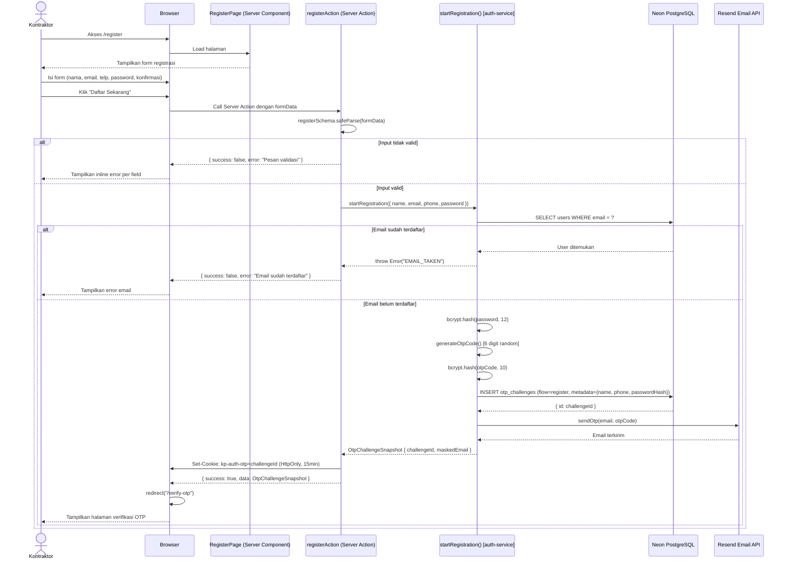

# System Logic: SL-001 Registrasi Kontraktor

Document Version: v1.0

System Logic ID: SL-001

Related Use Case: UC-001

Use Case Name: Registrasi Kontraktor

Status: Active

Last Updated: 2026-06-23

Author: System Analyst AI

Source: Derived from `userflow_uc_001.md` + actual `src/features/auth/actions.ts`

---

## 1. Overview

Dokumen ini mendefinisikan system logic untuk alur registrasi kontraktor baru, mencakup sequence diagram dan Server Action contracts.

---

## 2. Sequence Diagram



---

## 3. Server Action Contracts

### 3.1 `registerAction`

**File:** `src/features/auth/actions.ts`

**Signature:**
```typescript
async function registerAction(
  _prevState: ActionResult<OtpChallengeSnapshot> | null,
  formData: FormData
): Promise<ActionResult<OtpChallengeSnapshot>>
```

**Input (FormData fields):**

| Field | Type | Constraint |
| --- | --- | --- |
| `name` | string | Required, min 2 karakter |
| `email` | string | Required, format email valid |
| `phone` | string | Optional, format nomor telepon |
| `password` | string | Required, min 8 karakter |
| `confirmPassword` | string | Required, harus sama dengan password |

**Validation Schema:** `registerSchema` (Zod) di `src/features/auth/actions.ts`

**Success Response:**
```typescript
{
  success: true,
  data: {
    challengeId: string,  // UUID OTP challenge
    maskedEmail: string,  // "k****@gmail.com"
    expiresAt: Date,
    resendAvailableAt: Date
  }
}
```

**Error Response:**
```typescript
{
  success: false,
  error: string  // Pesan error dalam Bahasa Indonesia
}
```

**Side Effects:**
- Set cookie `kp-auth-otp` (HttpOnly, Secure, 15 menit)
- INSERT ke `otp_challenges`
- Kirim email via Resend

---

### 3.2 `startRegistration()` — `auth-service.ts`

**File:** `src/features/auth/auth-service.ts`

**Signature:**
```typescript
async function startRegistration(data: {
  name: string
  email: string
  phone?: string
  password: string
}): Promise<OtpChallengeSnapshot>
```

**Process:**
1. `findUserByEmail(email)` → throw jika ada
2. `bcrypt.hash(password, 12)` → simpan di `metadata`
3. `generateOtpCode()` → 6 digit
4. `bcrypt.hash(otpCode, 10)` → simpan sebagai `code_hash`
5. INSERT `otp_challenges` dengan `flow: 'register'`, `metadata: { name, phone, passwordHash }`
6. `emailOtpService.sendOtp(email, otpCode)` via Resend
7. Return `OtpChallengeSnapshot`

**Throws:**
- `'EMAIL_TAKEN'` — email sudah ada di `users`
- `'EMAIL_SEND_FAILED'` — Resend gagal

---

## 4. Data Flow

| Step | Input | Process | Output |
| --- | --- | --- | --- |
| 1 | FormData | Validasi Zod (registerSchema) | Validated data |
| 2 | name, email, phone, password | Cek uniqueness email di DB | — |
| 3 | password | bcrypt.hash(password, 12) | passwordHash |
| 4 | — | generateOtpCode() | otpCode (6 digit) |
| 5 | otpCode | bcrypt.hash(otpCode, 10) | codeHash |
| 6 | flow, email, codeHash, metadata | INSERT otp_challenges | challengeId |
| 7 | email, otpCode | Resend sendOtp() | Email sent |
| 8 | challengeId | Set-Cookie kp-auth-otp | Cookie di browser |

---

## 5. Security Rules

| Rule | Detail |
| --- | --- |
| Password hashing | bcryptjs cost 12 |
| OTP hashing | bcryptjs cost 10 — tidak ada plaintext OTP di DB |
| Cookie | HttpOnly, Secure, SameSite=strict, MaxAge=900 (15 menit) |
| No plaintext | Password hash disimpan di `otp_challenges.metadata` (bukan plaintext) |
| Email normalization | Email di-lowercase sebelum INSERT dan query |

---

## 6. Traceability

| User Flow | Requirement | Server Action |
| --- | --- | --- |
| `userflow_uc_001.md` | F001 | `registerAction` → `startRegistration()` |
