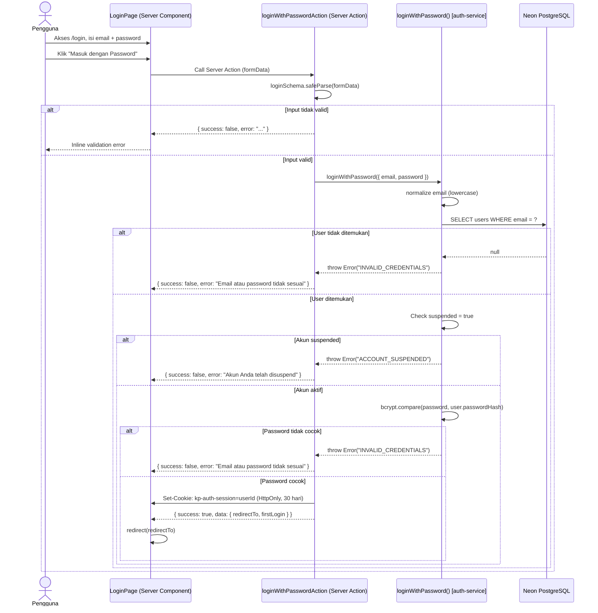
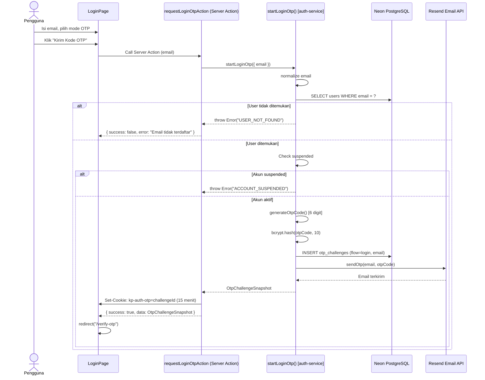

# System Logic: SL-002 Login (Password + OTP)

Document Version: v1.0

System Logic ID: SL-002

Related Use Cases: UC-002, UC-003

Use Case Names: Login dengan Password, Login dengan OTP Email

Status: Active

Last Updated: 2026-06-23

Author: System Analyst AI

Source: Derived from `userflow_uc_002.md`, `userflow_uc_003.md` + actual `src/features/auth/actions.ts`

---

## 1. Overview

Dokumen ini mendefinisikan dua jalur login yang tersedia: (1) login dengan password, dan (2) login dengan OTP email. Keduanya berujung pada `kp-auth-session` cookie jika berhasil — melalui path yang berbeda.

---

## 2. Sequence Diagrams

### 2.1 Login dengan Password (UC-002)



### 2.2 Login dengan OTP Email (UC-003)



---

## 3. Server Action Contracts

### 3.1 `loginWithPasswordAction`

**File:** `src/features/auth/actions.ts`

**Signature:**
```typescript
async function loginWithPasswordAction(
  _prevState: ActionResult<LoginSuccess> | null,
  formData: FormData
): Promise<ActionResult<LoginSuccess>>
```

**Input (FormData):**

| Field | Type | Constraint |
| --- | --- | --- |
| `email` | string | Required, format email |
| `password` | string | Required |

**Success Response:**
```typescript
{
  success: true,
  data: {
    redirectTo: "/dashboard" | "/admin",
    firstLogin: boolean
  }
}
```

**Error Response:**
```typescript
{ success: false, error: string }
```

**Side Effects:**
- Set cookie `kp-auth-session` (HttpOnly, Secure, 30 hari) berisi userId

---

### 3.2 `requestLoginOtpAction`

**File:** `src/features/auth/actions.ts`

**Signature:**
```typescript
async function requestLoginOtpAction(
  _prevState: ActionResult<OtpChallengeSnapshot> | null,
  formData: FormData
): Promise<ActionResult<OtpChallengeSnapshot>>
```

**Input (FormData):**

| Field | Type | Constraint |
| --- | --- | --- |
| `email` | string | Required, format email, harus terdaftar |

**Success Response:**
```typescript
{
  success: true,
  data: {
    challengeId: string,
    maskedEmail: string,
    expiresAt: Date,
    resendAvailableAt: Date
  }
}
```

**Side Effects:**
- Set cookie `kp-auth-otp` (15 menit)
- INSERT `otp_challenges` (flow: 'login')
- Kirim email via Resend

---

### 3.3 `loginWithPassword()` — auth-service.ts

**Signature:**
```typescript
async function loginWithPassword(data: {
  email: string
  password: string
}): Promise<LoginSuccess>
```

**Process:**
1. normalize email lowercase
2. `findUserByEmail(email)` → throw `INVALID_CREDENTIALS` jika null
3. Check `user.suspended` → throw `ACCOUNT_SUSPENDED`
4. `bcrypt.compare(password, user.passwordHash)` → throw `INVALID_CREDENTIALS` jika false
5. Return `{ redirectTo, firstLogin }`

**Cookie di-set oleh caller (`loginWithPasswordAction`):**
- `kp-auth-session` = userId, 30 hari

---

### 3.4 `startLoginOtp()` — auth-service.ts

**Signature:**
```typescript
async function startLoginOtp(data: {
  email: string
}): Promise<OtpChallengeSnapshot>
```

**Process:**
1. normalize email lowercase
2. `findUserByEmail(email)` → throw `USER_NOT_FOUND` jika null
3. Check `user.suspended`
4. `generateOtpCode()` → 6 digit
5. `bcrypt.hash(code, 10)`
6. INSERT `otp_challenges` (flow: 'login')
7. `emailOtpService.sendOtp(email, code)`
8. Return `OtpChallengeSnapshot`

---

## 4. Redirect Logic

| Role | redirectTo |
| --- | --- |
| `contractor` | `/dashboard` |
| `moderator` | `/admin` |
| `super_admin` | `/admin` |

---

## 5. Security Rules

| Rule | Detail |
| --- | --- |
| Password never exposed | bcrypt.compare() — tidak ada plaintext comparison |
| Generic error message | "Email atau password tidak sesuai" (tidak mengungkap mana yang salah) |
| Session cookie | HttpOnly, Secure, SameSite=strict, MaxAge=2592000 (30 hari) |
| Suspended check | Dilakukan sebelum password verification |

---

## 6. Traceability

| User Flow | Requirement | Server Action |
| --- | --- | --- |
| `userflow_uc_002.md` | F001 | `loginWithPasswordAction` → `loginWithPassword()` |
| `userflow_uc_003.md` | F001 | `requestLoginOtpAction` → `startLoginOtp()` |
