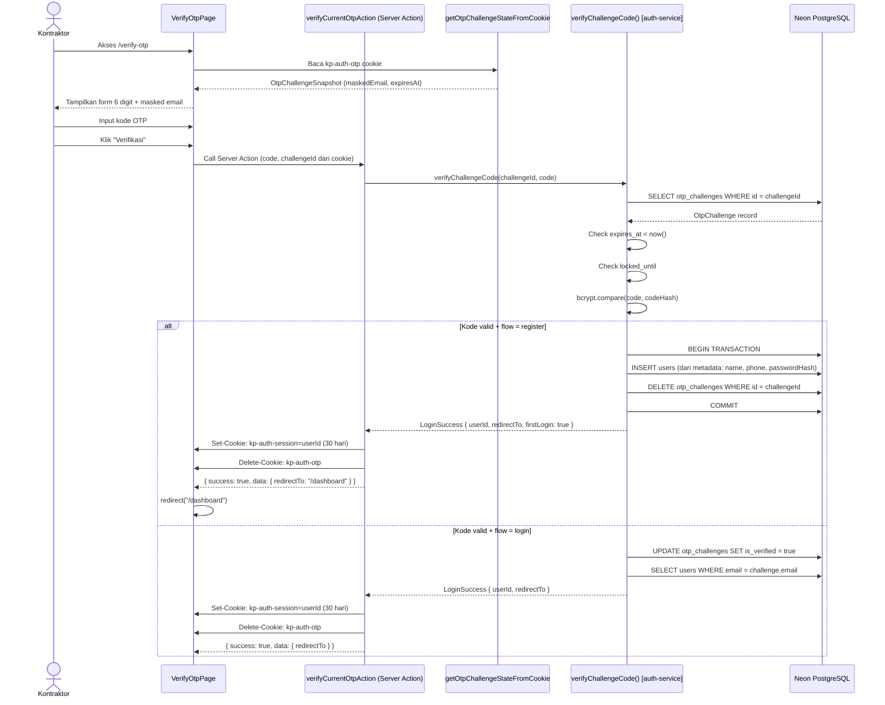
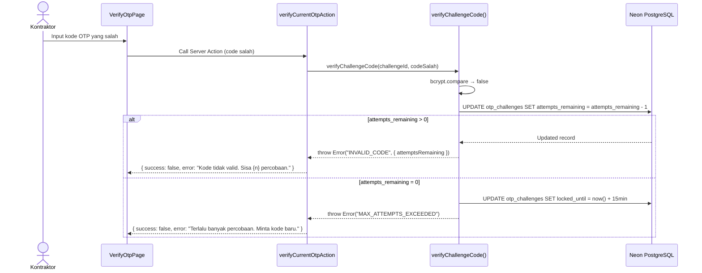
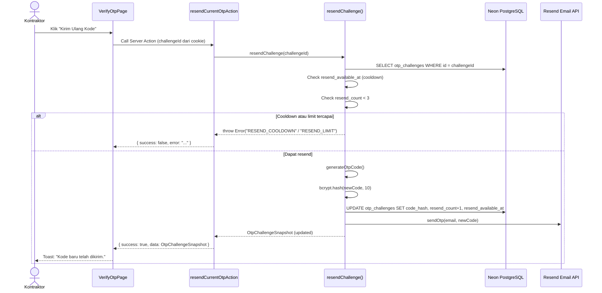

# System Logic: SL-003 Verifikasi OTP

Document Version: v1.0

System Logic ID: SL-003

Related Use Case: UC-004

Use Case Name: Verifikasi OTP

Status: Active

Last Updated: 2026-06-23

Author: System Analyst AI

Source: Derived from `userflow_uc_004.md` + actual `src/features/auth/actions.ts`

---

## 1. Overview

Dokumen ini mendefinisikan system logic untuk verifikasi kode OTP 6 digit yang berlaku untuk dua flow: registrasi dan login OTP. Logic ini dibagi antara verify utama dan resend OTP.

---

## 2. Sequence Diagrams

### 2.1 Verifikasi OTP Berhasil (Flow Register)



### 2.2 Kode Salah / Lockout



### 2.3 Resend OTP



---

## 3. Server Action Contracts

### 3.1 `verifyCurrentOtpAction`

**File:** `src/features/auth/actions.ts`

**Signature:**
```typescript
async function verifyCurrentOtpAction(
  _prevState: ActionResult<LoginSuccess> | null,
  formData: FormData
): Promise<ActionResult<LoginSuccess>>
```

**Input (FormData):**

| Field | Type | Constraint |
| --- | --- | --- |
| `code` | string | Required, 6 digit numerik |

**Cookie dibaca:** `kp-auth-otp` (untuk mendapatkan `challengeId`)

**Success Response:**
```typescript
{
  success: true,
  data: {
    redirectTo: "/dashboard" | "/admin",
    firstLogin: boolean
  }
}
```

**Side Effects:**
- Set cookie `kp-auth-session` (30 hari)
- Delete cookie `kp-auth-otp`
- (flow=register) INSERT `users`, DELETE `otp_challenges`
- (flow=login) UPDATE `otp_challenges.is_verified = true`

---

### 3.2 `resendCurrentOtpAction`

**File:** `src/features/auth/actions.ts`

**Signature:**
```typescript
async function resendCurrentOtpAction(
  _prevState: ActionResult<OtpChallengeSnapshot> | null,
  formData: FormData
): Promise<ActionResult<OtpChallengeSnapshot>>
```

**Cookie dibaca:** `kp-auth-otp`

**Success Response:**
```typescript
{
  success: true,
  data: OtpChallengeSnapshot  // Updated challenge state
}
```

**Side Effects:**
- UPDATE `otp_challenges` (code_hash baru, resend_count+1, resend_available_at baru)
- Kirim email OTP baru via Resend

---

### 3.3 `getOtpChallengeStateFromCookie`

**File:** `src/features/auth/actions.ts`

**Signature:**
```typescript
async function getOtpChallengeStateFromCookie(): Promise<OtpChallengeSnapshot | null>
```

**Cookie dibaca:** `kp-auth-otp`

**Returns:** `OtpChallengeSnapshot` (tanpa `codeHash`, tanpa `debugCode`) atau `null` jika tidak ada cookie/expired.

**Usage:** Dipanggil di `page.tsx` untuk pre-populate halaman verify-otp dengan `maskedEmail`.

---

## 4. verifyChallengeCode() — Logic Detail

**File:** `src/features/auth/auth-service.ts`

```typescript
async function verifyChallengeCode(
  challengeId: string,
  code: string
): Promise<LoginSuccess>
```

**Step by step:**
1. SELECT `otp_challenges` WHERE `id = challengeId`
2. Throw `CHALLENGE_NOT_FOUND` jika null
3. Check `expires_at < now()` → throw `CHALLENGE_EXPIRED`
4. Check `locked_until != null && locked_until > now()` → throw `ACCOUNT_LOCKED`
5. `bcrypt.compare(code, codeHash)` → false: update `attempts_remaining--`, throw `INVALID_CODE`
6. Jika `attempts_remaining` = 0: set `locked_until`, throw `MAX_ATTEMPTS_EXCEEDED`
7. **Flow `register`:**
   - BEGIN TRANSACTION
   - INSERT `users` (ambil name, phone dari `metadata`, ambil `passwordHash` dari `metadata`)
   - DELETE `otp_challenges` WHERE id
   - COMMIT
   - Return `LoginSuccess { userId: newUser.id, redirectTo: '/dashboard', firstLogin: true }`
8. **Flow `login`:**
   - UPDATE `otp_challenges` SET `is_verified = true`
   - `findUserByEmail(challenge.email)` 
   - Return `LoginSuccess { userId: user.id, redirectTo, firstLogin: user.firstLogin }`

---

## 5. Security Rules

| Rule | Detail |
| --- | --- |
| OTP never stored plaintext | bcrypt.compare() selalu digunakan |
| Max attempts | 5 percobaan sebelum lockout |
| Max resend | 3x per challenge |
| Resend cooldown | `resend_available_at` mencegah spam |
| Transaction integrity | register: INSERT+DELETE dalam satu DB transaction |
| Cookie cleanup | `kp-auth-otp` dihapus setelah berhasil |

---

## 6. Traceability

| User Flow | Requirement | Server Action |
| --- | --- | --- |
| `userflow_uc_004.md` | F001 | `verifyCurrentOtpAction` → `verifyChallengeCode()` |
| `userflow_uc_004.md` | F001 | `resendCurrentOtpAction` → `resendChallenge()` |
