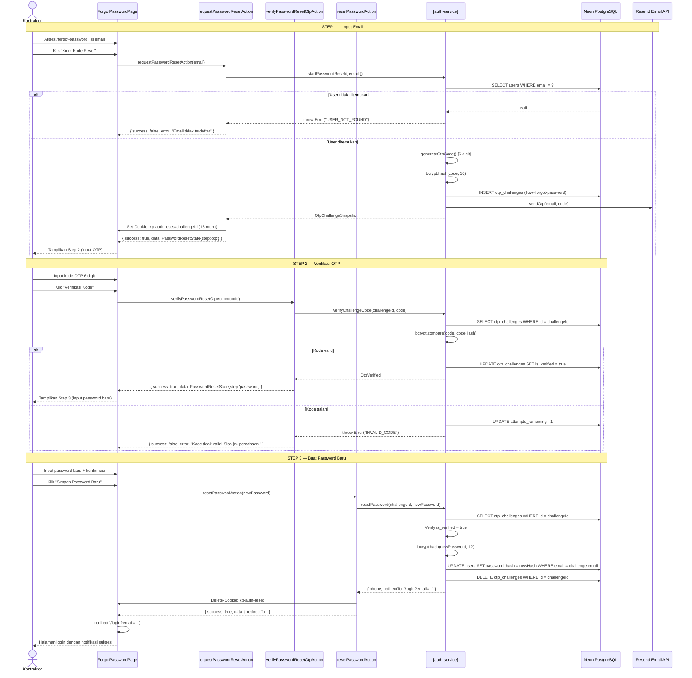

# System Logic: SL-004 Reset Password

Document Version: v1.0

System Logic ID: SL-004

Related Use Case: UC-005

Use Case Name: Reset Password (Lupa Password)

Status: Active

Last Updated: 2026-06-23

Author: System Analyst AI

Source: Derived from `userflow_uc_005.md` + actual `src/features/auth/actions.ts`

---

## 1. Overview

Dokumen ini mendefinisikan system logic untuk alur reset password 3-step di halaman `/forgot-password`. Tiga Server Actions berbeda menangani masing-masing step. Cookie `kp-auth-reset` menjadi penghubung antar step.

---

## 2. Sequence Diagram



---

## 3. Server Action Contracts

### 3.1 `requestPasswordResetAction` (Step 1)

**File:** `src/features/auth/actions.ts`

**Signature:**
```typescript
async function requestPasswordResetAction(
  _prevState: ActionResult<PasswordResetState> | null,
  formData: FormData
): Promise<ActionResult<PasswordResetState>>
```

**Input (FormData):**

| Field | Type | Constraint |
| --- | --- | --- |
| `email` | string | Required, format email, harus terdaftar |

**Success Response:**
```typescript
{
  success: true,
  data: PasswordResetState  // { step: 'otp', maskedEmail, ... }
}
```

**Side Effects:**
- Set cookie `kp-auth-reset` (15 menit)
- INSERT `otp_challenges` (flow: 'forgot-password')
- Kirim email OTP via Resend

---

### 3.2 `verifyPasswordResetOtpAction` (Step 2)

**Signature:**
```typescript
async function verifyPasswordResetOtpAction(
  _prevState: ActionResult<PasswordResetState> | null,
  formData: FormData
): Promise<ActionResult<PasswordResetState>>
```

**Input (FormData):**

| Field | Type | Constraint |
| --- | --- | --- |
| `code` | string | Required, 6 digit numerik |

**Cookie dibaca:** `kp-auth-reset`

**Success Response:**
```typescript
{
  success: true,
  data: PasswordResetState  // { step: 'password', ... }
}
```

**Side Effects:**
- UPDATE `otp_challenges.is_verified = true`

---

### 3.3 `resetPasswordAction` (Step 3)

**Signature:**
```typescript
async function resetPasswordAction(
  _prevState: ActionResult<{ phone: string | null; redirectTo: string }> | null,
  formData: FormData
): Promise<ActionResult<{ phone: string | null; redirectTo: string }>>
```

**Input (FormData):**

| Field | Type | Constraint |
| --- | --- | --- |
| `password` | string | Required, min 8 karakter |
| `confirmPassword` | string | Required, harus sama dengan password |

**Cookie dibaca:** `kp-auth-reset`

**Success Response:**
```typescript
{
  success: true,
  data: {
    phone: string | null,
    redirectTo: "/login?email=..."
  }
}
```

**Side Effects:**
- UPDATE `users.password_hash` (bcrypt hash cost 12)
- DELETE `otp_challenges` WHERE id
- Delete cookie `kp-auth-reset`

---

### 3.4 `resendPasswordResetOtpAction`

**Signature:**
```typescript
async function resendPasswordResetOtpAction(
  _prevState: ActionResult<PasswordResetState> | null,
  formData: FormData
): Promise<ActionResult<PasswordResetState>>
```

**Cookie dibaca:** `kp-auth-reset`

**Side Effects:**
- UPDATE `otp_challenges` (kode baru, resend_count+1)
- Kirim email OTP baru via Resend

---

### 3.5 `getPasswordResetStateFromCookie`

**Signature:**
```typescript
async function getPasswordResetStateFromCookie(): Promise<PasswordResetState>
```

**Cookie dibaca:** `kp-auth-reset`

**Returns:** `PasswordResetState` — state saat ini dari alur reset (step 1/2/3, maskedEmail, dll.)

---

## 4. resetPassword() — Logic Detail

**File:** `src/features/auth/auth-service.ts`

```typescript
async function resetPassword(
  challengeId: string,
  newPassword: string
): Promise<{ phone: string | null; redirectTo: string }>
```

**Step by step:**
1. SELECT `otp_challenges` WHERE `id = challengeId`
2. Throw jika tidak ditemukan
3. Verify `is_verified = true` → throw jika false (langkah 2 belum selesai)
4. `bcrypt.hash(newPassword, 12)`
5. `updateUserPassword(challenge.email, newHash)` → UPDATE `users`
6. DELETE `otp_challenges` WHERE id
7. Return `{ phone: user.phone, redirectTo: '/login?email=...' }`

---

## 5. PasswordResetState Type

```typescript
type PasswordResetState = {
  step: 'email' | 'otp' | 'password' | 'done'
  challengeId?: string
  maskedEmail?: string
  expiresAt?: Date
  resendAvailableAt?: Date
  resendCount?: number
  phone?: string | null
  redirectTo?: string
}
```

---

## 6. Security Rules

| Rule | Detail |
| --- | --- |
| Step order enforced | Step 3 hanya diizinkan jika `is_verified = true` di DB |
| Password hashing | bcrypt cost 12 untuk password baru |
| Cookie cleanup | `kp-auth-reset` dihapus setelah reset berhasil |
| No password in plaintext | Hash langsung sebelum UPDATE |
| Challenge cleanup | DELETE setelah reset — tidak bisa digunakan ulang |

---

## 7. Traceability

| User Flow | Requirement | Server Actions |
| --- | --- | --- |
| `userflow_uc_005.md` | F001 | `requestPasswordResetAction` → `startPasswordReset()` |
| `userflow_uc_005.md` | F001 | `verifyPasswordResetOtpAction` → `verifyChallengeCode()` |
| `userflow_uc_005.md` | F001 | `resetPasswordAction` → `resetPassword()` |
